## Challenge Information

```
Let's start your journey through encodings with something simple. This program takes a password, but you have no way to know what it is... unless you _READ_ it!

In most cybersecurity analysis settings, you will be analyzing software that you did not write, like this program. Thus, the very first skill you will learn in this module is to read software to understand what is the data that it wants you to send. We'll start with this trivial Python program.

The program lives in `/challenge/runme`, and will request a tricky password before it gives you the flag. It's going to be the simplest program you read in your journey, as it just reads data over standard input and makes one simple check.

Read the program, understand the Python, and make the program give you the flag!
```


## 1. `What's the password?`


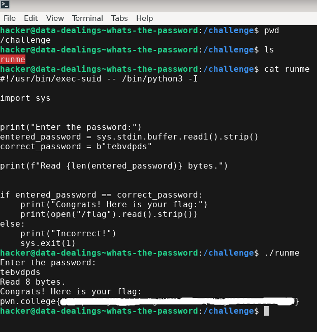

As the challenge asked I went to the `/challenge` directory location and read the **runme** file. The script is asking us to input a certain text and then compares our input to the original string input. If our input and the original input is equal then the **flag** is printed. I will be hiding the flag because I want you to try it yourselves and find the answer.


## 2. `...and again!`


This challenge follows the same concept used is the previous challenge. Read the code, understand it, then provide the input to get the flag.

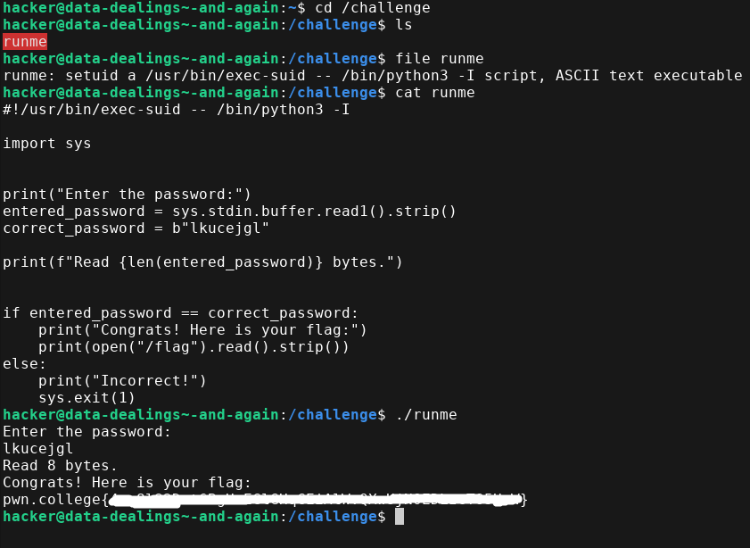


## 3. `Newline Troubles`


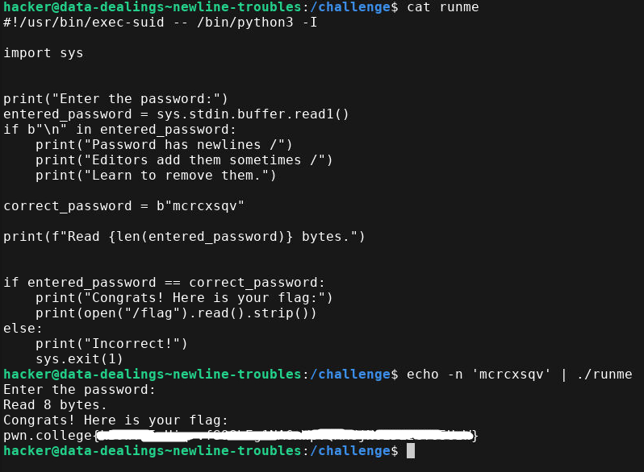

The program wants us to provide a certain string as input but the catch is it will also take the **enter or \n** as part of the input as well so we need to prevent that from happening. `echo -n` commands helps us supply our input string value without appending the **newline or \n**.


## 4. `Reasoning about files`

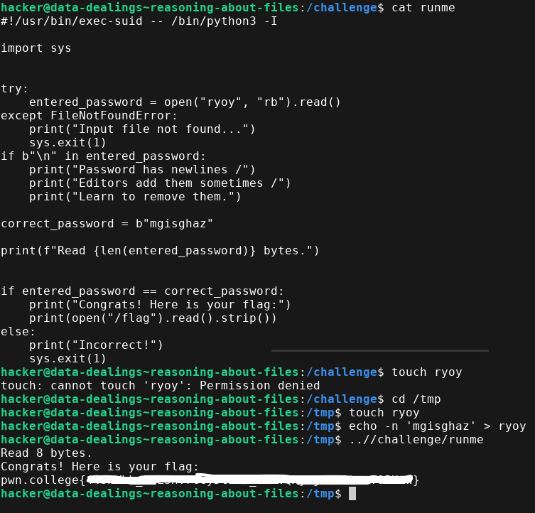

The program reads bytes of the string from a file named **ryoy** and matches the string inside the file with the program string. I first tried to create the file in that same directory but was unable due to insufficient permissions so I created the file in the **/tmp** directory. After that I added the input string using the same `echo -n` to prevent appending the newline. 


## 5. `Specifying Filenames`

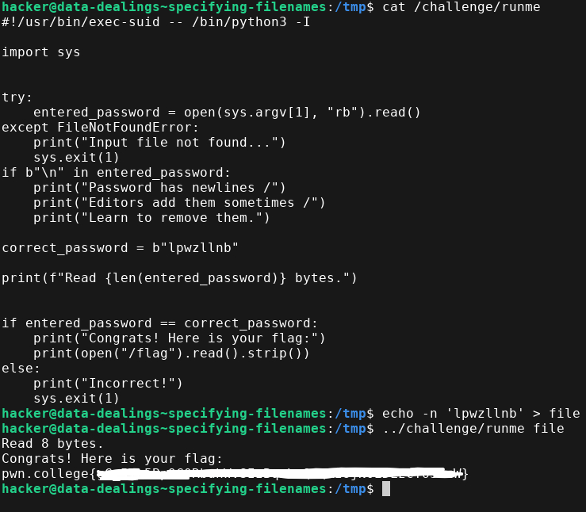

Create a file and provide the necessary input string and supply the filename as the command line argument for the **runme** program string.


## 6. `Binary and Hex Encoding`

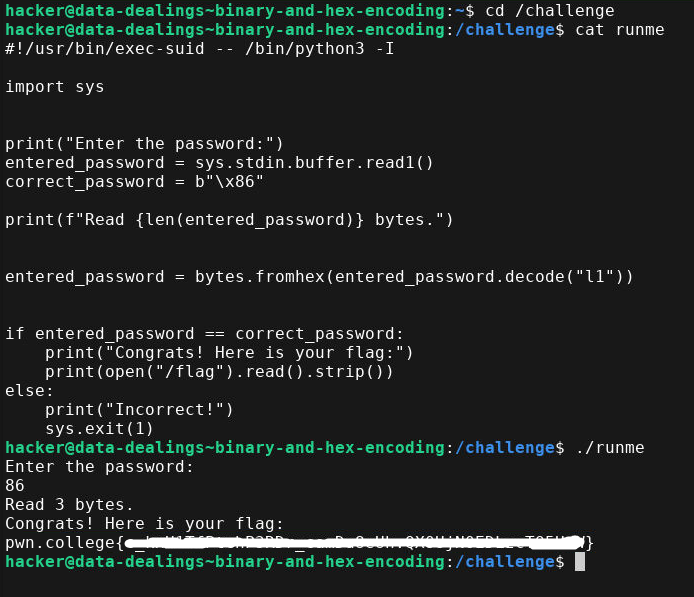

The program takes **input in raw bytes** then converts them into string format using **decode()** and then uses the **bytes.fromhex** method to convert the hex string to bytes format again. Analyze the program carefully and I am sure you will understand why I gave **86** as input. You can open up a python command line interpreter to clarify your thought process.


## 7. `More Hex`

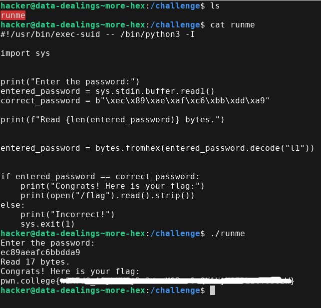

Same as the previous challenge. **Reads input in raw bytes**, then converts to string using **decode()** and then to bytes using **bytes.fromhex()**. If you understood the previous one this one should be cake walk as well.


## 8. `Decoding Hex`

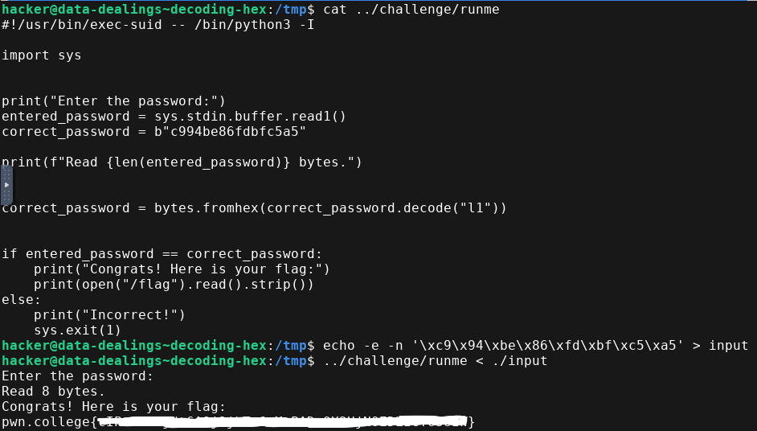

The `\x` interprets each pair of characters as a single byte which makes the it 8 bytes in total. But the original byte literal there are 16 bytes in total because each character is interpreted as a single byte. So we used `echo -e` to produce the raw binary data into the file.


## 9. `Decoding Practice`

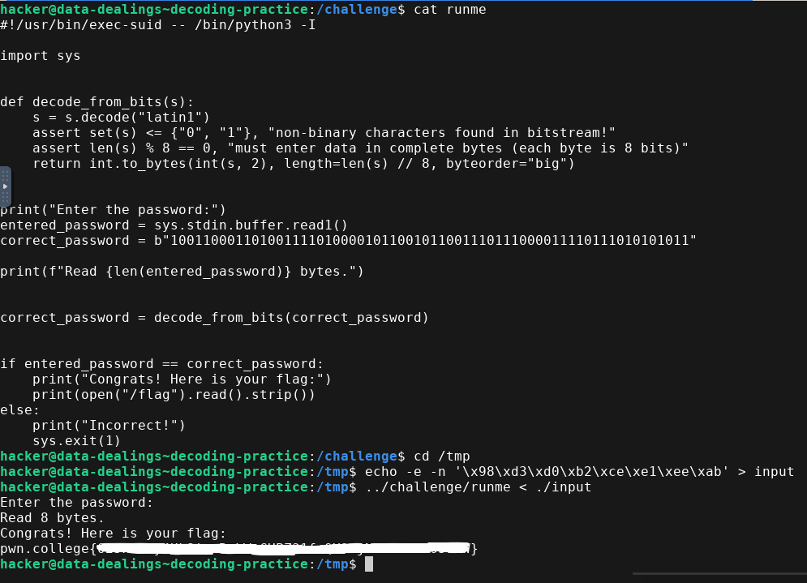

I edited the code by copying it and then printing the **correct_password** variable. The value came `b'\x98\xd3\xd0\xb2\xce\xe1\xee\xab'`  so this raw bytes was compared with the **entered_password**. So as usual I used the `echo -e` to interpret the `\xNN` as a single byte and match **entered_password** and **correct_password**.


## 10. `Encoding Practice`

We need to first convert the `b"\x8a\xed\xec\xc4\xed\x95\xf7\xb8"` in bits. Below is the python program for that.

```python
byte_string = b'\x8a\xed\xec\xc4\xed\x95\xf7\xb8'
binary_representation = []

for byte_value in byte_string:
    # Convert each byte (integer 0-255) to its 8-bit binary representation
    # The '08b' format specifier ensures leading zeros are included for 8 bits
    binary_representation.append(format(byte_value, '08b'))
    
# Join the 8-bit binary strings for each byte into a single string
result = "".join(binary_representation)
print(result)
```

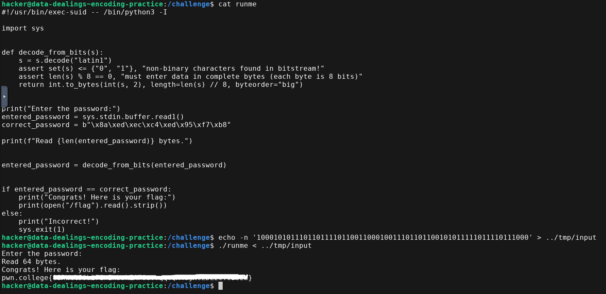

After copying the bits I used `echo -n` to prevent appending newline and added the bits into a file named **input**. Then I passed the content of the **input** file to the program and got the flag.


## 11. `Hex-encoding ASCII`

**NOTE: Python encodes string into bytes object which is equivalent to its ASCII value. Check this using `man ascii` command.**

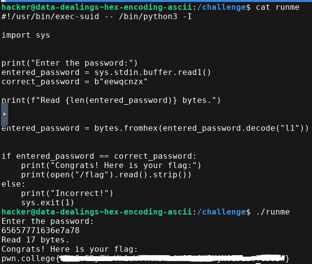

I passed the ASCII values corresponding to the string `eewqcnzx`. I used gdb for displaying the hex values of the string.

```bash
hacker@data-dealings~hex-encoding-ascii:/challenge$ gdb -q
(gdb) p/x "eewqcnzx"
$1 = {0x65, 0x65, 0x77, 0x71, 0x63, 0x6e, 0x7a, 0x78, 0x0}
```


## 12. `Nested Encoding`


#### Challenge Program

```python
hacker@data-dealings~nested-encoding:/tmp$ cat ../challenge/runme
#!/usr/bin/exec-suid -- /bin/python3 -I

import sys


try:
    entered_password = open("vdho", "rb").read()
except FileNotFoundError:
    print("Input file not found...")
    sys.exit(1)
correct_password = b"pkukrtnj"

print(f"Read {len(entered_password)} bytes.")


entered_password = bytes.fromhex(entered_password.decode("l1"))
entered_password = bytes.fromhex(entered_password.decode("l1"))
entered_password = bytes.fromhex(entered_password.decode("l1"))
entered_password = bytes.fromhex(entered_password.decode("l1"))


if entered_password == correct_password:
    print("Congrats! Here is your flag:")
    print(open("/flag").read().strip())
else:
    print("Incorrect!")
    sys.exit(1)

```


Now here our **correct_password** is decoded 4 times so we need to perform encoding and hexing 4 times as well because any lesser than that either we are going to get a format where **hex()** operation cannot be performed or during **bytes.fromhex()** our data will be having non-hexadecimal values.

I used the python command line interpreter to form my input data. Below is the code snippet for that.

```bash
hacker@data-dealings~nested-encoding:/tmp$ python
Python 3.12.11 (main, Jun  3 2025, 15:41:47) [GCC 14.2.1 20250322] on linux
Type "help", "copyright", "credits" or "license" for more information.
>>> a=b'pkukrtnj'
>>> h=a.hex().encode().hex().encode().hex().encode().hex()
>>> h
'33333337333333303333333633363332333333373333333533333336333633323333333733333332333333373333333433333336333633353333333633363331'
>>> exit()
hacker@data-dealings~nested-encoding:/tmp$ echo -n 33333337333333303333333633363332333333373333333533333336333633323333333733333332333333373333333433333336333633353333333633363331 > vdho
```


Now copy this hex value to the **vhdo** file and run the **runme** program to get the flag.

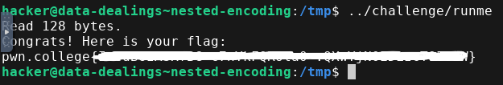

We got the flag!!!.


## 13. `Hex-encoding UTF-8`


#### Challenge Program

```python
hacker@data-dealings~hex-encoding-utf-8:/tmp$ cat ../challenge/runme
#!/usr/bin/exec-suid -- /bin/python3 -I

import sys


print("Enter the password:")
entered_password = sys.stdin.buffer.read1()
correct_password = "📊 🚔 🔦 🕞".encode("utf-8")

print(f"Read {len(entered_password)} bytes.")


entered_password = bytes.fromhex(entered_password.decode("l1"))


if entered_password == correct_password:
    print("Congrats! Here is your flag:")
    print(open("/flag").read().strip())
else:
    print("Incorrect!")
    sys.exit(1)
```

I edited the code a bit so that i could print the **correct_password** value and get the **hex byte string** for the emojis.

```bash
hacker@data-dealings~hex-encoding-utf-8:/tmp$ cat test.py
correct_password = "📊 🚔 🔦 🕞".encode("utf-8")
print(f"Read {len(correct_password)} bytes.")
print(correct_password)
hacker@data-dealings~hex-encoding-utf-8:/tmp$ python test.py 
Read 19 bytes.
b'\xf0\x9f\x93\x8a \xf0\x9f\x9a\x94 \xf0\x9f\x94\xa6 \xf0\x9f\x95\x9e'
```

**NOTE: the hex value for spaces is 0x20 which is not mentioned here. You will need this later.**

```bash
hacker@data-dealings~hex-encoding-utf-8:/tmp$ echo -n 'f09f938a20f09f9a9420f09f94a620f09f959e' > input
```

I provided the hex values of the emojis and also provided the hex value for the spaces. There were 3 spaces so 0x20 will be given as input 3 times. I stored the data inside a file and used `echo -n` command to prevent appending new line so that those extra bytes don't mess my logic. 

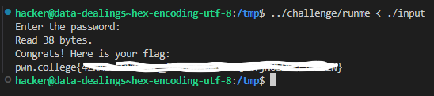


## 14. `UTF Mixups`

The challenge program here is decoded using **utf-16** and then encoded using **latin1** so there will be error. 
##### IMPORTANT POINTS
- UTF-16 takes 2 bytes 
- UTF-16 stores those bytes in Little Endian.

Remember these 2 points because you need to arrange your **hex bytes** accordingly. I used gdb first to get the hex value of the `mpseczuv`.

```bash
hacker@data-dealings~utf-mixups:/challenge$ gdb -q
(gdb) p/x "mpseczuv"
$1 = {0x6d, 0x70, 0x73, 0x65, 0x63, 0x7a, 0x75, 0x76, 0x0}
```

If this is the hex value according to the **utf-8** then the **utf-16** arrangement will be `\x6d\x00\x70\x00\x73\x00\x65\x00\x63\x00\x7a\x00\x75\x00\x76\x00`.

```bash
hacker@data-dealings~utf-mixups:/tmp$ echo -e -n '\x6d\x00\x70\x00\x73\x00\x65\x00\x63\x00\x7a\x00\x75\x00\x76\x00' > input2
hacker@data-dealings~utf-mixups:/tmp$ cat input2
mpseczuv
```

The program reads the data in bytes so I used `echo -e` to interpret those `\x` as a byte. The terminal was able to connect the **utf-16** encoding and print the characters in a readable format.

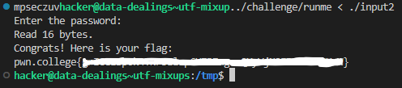


## 15. `Modifying Encoded Data`

I used the python command line interpreter to solve this challenge by experimenting and analyzing the hex values and the decoding and encoding. Below is how I did it.

```bash
hacker@data-dealings~modifying-encoded-data:~$ python
Python 3.12.11 (main, Jun  3 2025, 15:41:47) [GCC 14.2.1 20250322] on linux
Type "help", "copyright", "credits" or "license" for more information.
>>> original=b'\xdcr\x9dn\x14W\xab\xbe'  ------>(OUR CORRECT PASSWORD)
>>> original.hex()
'dc729d6e1457abbe'   ---------> (HEX FORM OF CORRECT PASSWORD)
>>> 'dc729d6e1457abbe'[::-1] ----> (REVERSE OF HEX FORM)
'ebba7541e6d927cd'
>>> b'dc729d6e1457abbe'.decode('l1')
'dc729d6e1457abbe'
>>> bytes.fromhex('dc729d6e1457abbe')
b'\xdcr\x9dn\x14W\xab\xbe' 
```

So  according to the above analysis our input should be `ebba7541e6d927cd`.

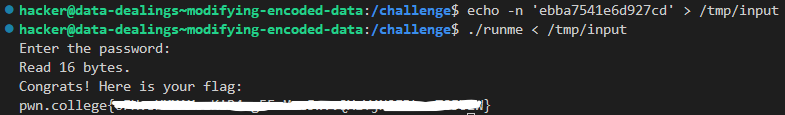


## 16. `Decoding Base64`

Read the **runme** file carefully and try to understand the code. I used the python command line interpreter to get the value of the **correct_password** so that I can configure my input data accordingly.

```bash
hacker@data-dealings~decoding-base64:~$ python
Python 3.12.11 (main, Jun  3 2025, 15:41:47) [GCC 14.2.1 20250322] on linux
Type "help", "copyright", "credits" or "license" for more information.
>>> original=b'rFSn2eTJLic='
>>> import base64
>>> base64.b64decode(original)
b"\xacT\xa7\xd9\xe4\xc9.'"
```

So the input data should be `\xacT\xa7\xd9\xe4\xc9.'` 

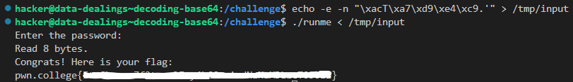


## 17. `Encoding Base64`

In this challenge we need to encoded our input data. I used the python command line interpreter to form the input data.

```bash
>>> input=b'\x832\xdb\xc4\xc5\xd0\xaa\x8a'
>>> base64.b64encode(input)
b'gzLbxMXQqoo='     ------------------------> (INPUT)
>>> encode=base64.b64encode(input)
>>> encode
b'gzLbxMXQqoo='
>>> decode=encode.decode('l1')
>>> decode
'gzLbxMXQqoo='    
>>> baseDecode=base64.b64decode(decode)
>>> baseDecode
b'\x832\xdb\xc4\xc5\xd0\xaa\x8a'
```

You can also use the **echo** command to supply the raw bytes to **base64** in the terminal to form the encoding directly in the terminal without having to use the python command line interpreter.

```bash
hacker@data-dealings~encoding-base64:/challenge$ echo -e -n '\x832\xdb\xc4\xc5\xd0\xaa\x8a' | base64
gzLbxMXQqoo=
```

Now copy this **base64** encoding value and copy into a file without any newlines using `echo -n`.

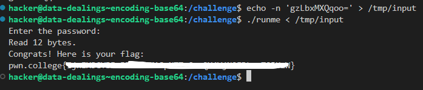


## 18. `Dealing with Obsfucation`

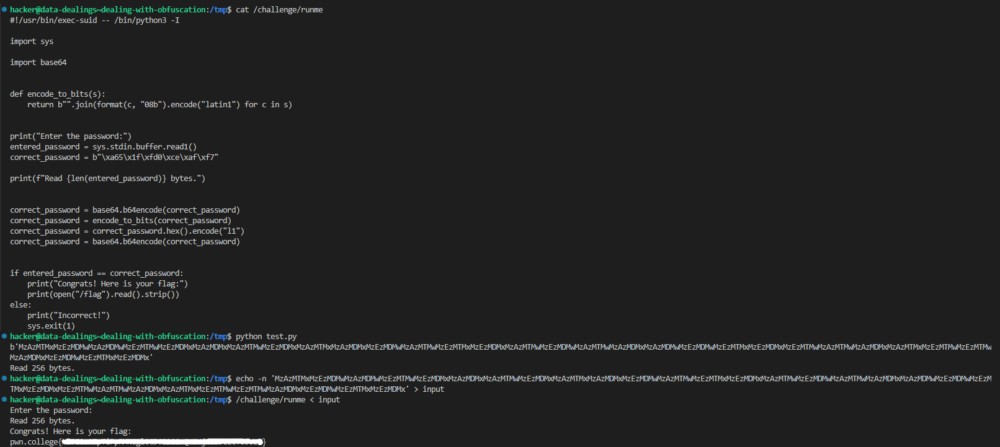

I copied the code from the **runme** file into a different file named **test.py** and printed the value of the **correct_password** variable to get the value. After that I copied that data into a file named **input** using `echo -n` command to prevent addition of newlines.


## 19. `Dealing with Obfuscation 2`

Analyzing the program I understood that our input gets decoded 2 times in base64 and there is a string reversal which can be ignored because its performed 2 times on our input so it gets cancelled out. I edited the **runme** file and printed the **correct_password** value.

```bash
correct password before obfuscation => 8 bytes.
b'==QP9EVT3VEVNdXQE10dBRVT4VEVNdXRE10dBRVT3VERNhXRU10dFRUT3FERNdXQE10dFRVT3FEVNhXRE10dFRUT3VERNdXRE10dBRUT3FEVNhXQU10dFRUT'
correct password after obfuscation => 120 bytes
```

Notice the `==` sign is before which is incorrect padding in base64 encoding but the **correct_password** encoding gets reversed in the **runme** file for obfuscation.

So basically, we need to reverse the encoding of the **correct_password** and perform base64 encoding twice on it to get our input data.

```bash
hacker@data-dealings~dealing-with-obfuscation-2:/tmp$ python test.py
correct password before obfuscation => 8 bytes.
b'==QP9EVT3VEVNdXQE10dBRVT4VEVNdXRE10dBRVT3VERNhXRU10dFRUT3FERNdXQE10dFRVT3FEVNhXRE10dFRUT3VERNdXRE10dBRUT3FEVNhXQU10dFRUT'
correct password after obfuscation => 120 bytes.
hacker@data-dealings~dealing-with-obfuscation-2:/tmp$ python 
Python 3.12.11 (main, Jun  3 2025, 15:41:47) [GCC 14.2.1 20250322] on linux
Type "help", "copyright", "credits" or "license" for more information.
>>> import base64
>>> input=b'==QP9EVT3VEVNdXQE10dBRVT4VEVNdXRE10dBRVT3VERNhXRU10dFRUT3FERNdXQE10dFRVT3FEVNhXRE10dFRUT3VERNdXRE10dBRUT3FEVNhXQU10dFRUT'
>>> encode1=base64.b64encode(input)
>>> encode2=base64.b64encode(encode1)
>>> encode2
b'UFQxUlVEbEZWbFF6VmtWV1RtUllVVVV4TUdSQ1VsWlVORlpGVms1a1dGSkZNVEJrUWxKV1ZETldSVkpPYUZoU1ZURXdaRVpTVlZRelJrVlNUbVJZVVVVeE1HUkdVbFpVTTBaRlZrNW9XRkpGTVRCa1JsSlZWRE5XUlZKT1pGaFNSVEV3WkVKU1ZWUXpSa1ZXVG1oWVVWVXhNR1JHVWxWVQ=='
```

So our input data is `UFQxUlVEbEZWbFF6VmtWV1RtUllVVVV4TUdSQ1VsWlVORlpGVms1a1dGSkZNVEJrUWxKV1ZETldSVkpPYUZoU1ZURXdaRVpTVlZRelJrVlNUbVJZVVVVeE1HUkdVbFpVTTBaRlZrNW9XRkpGTVRCa1JsSlZWRE5XUlZKT1pGaFNSVEV3WkVKU1ZWUXpSa1ZXVG1oWVVWVXhNR1JHVWxWVQ==`.

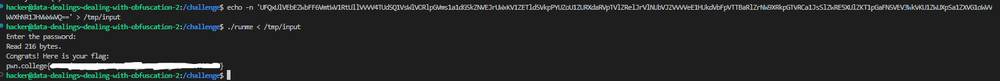


Finally!!! **Dealing with Data** module is completed. I hope whoever is reading this story has understood my steps and was able to replicate them to get the flag.