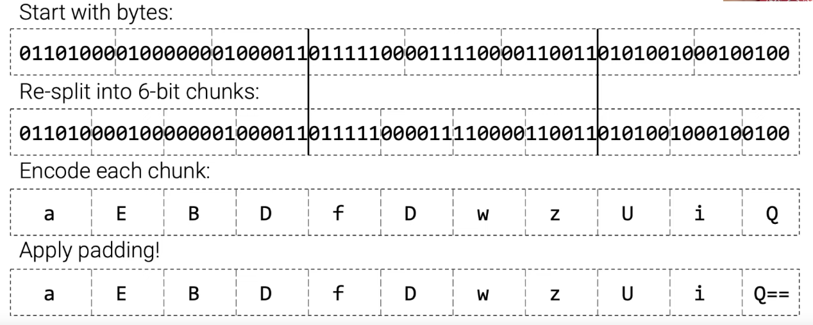

- A scheme to convert binary data to text or string or in a sequence of printable characters
- `Base64` converts the binary data and represents in ASCII string format.
- `Base64` is limited to a set of 64 characters.
- These **64 characters** must be common so they were chosen.
- The binary data is split into **6 bits chunk**.

**NOTE: some characters like newline or something else .... basically some characters even after conversion are not printable.**

### base64 example

- The binary data is split into 6 bit chunks from the left to right.
- 64 characters are there so the encoding is done as per the base64 mapping.
- The number of characters need to be multiple of 4 so when that doesn't happen we add `=` for each 6 bits of 0's we added. If `==` then it means 2 6 bit chunks of 0's.

[Base64 Table](https://www.garykessler.net/library/base64.html)