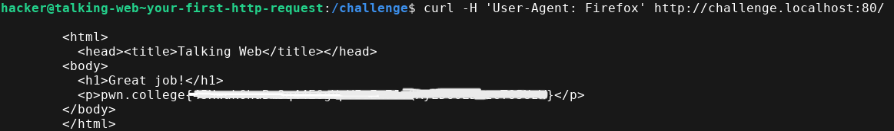

## Challenge Information

```
Obviously, as you're accessing this website in your web browser, this isn't your _first_ HTTP request. But it's your first HTTP request for a pwn.college challenge! Run `/challenge/server`, fire up Firefox in the dojo workspace (you'll need to use the [GUI Desktop](https://pwn.college/workspace/desktop) for this!), and visit the URL that it's listening on for the flag!
```


## `Your First HTTP Request`

I executed the program which is located in `/challenge` directory. The filename is `server.` Upon running the script the URL will be revealed as shown below.

```bash
hacker@talking-web~your-first-http-request:/challenge$ ./server
 * Serving Flask app 'server'
 * Debug mode: off
WARNING: This is a development server. Do not use it in a production deployment. Use a production WSGI server instead.
 * Running on http://challenge.localhost:80
Press CTRL+C to quit
```


The script will only reveal the flag if the requests' User Agent is **Firefox**. So, I used `curl` to send the request.



