## Challenge Information

```
Obviously, as you're accessing this website in your web browser, this isn't your _first_ HTTP request. But it's your first HTTP request for a pwn.college challenge! Run `/challenge/server`, fire up Firefox in the dojo workspace (you'll need to use the [GUI Desktop](https://pwn.college/workspace/desktop) for this!), and visit the URL that it's listening on for the flag!
```


## 1. `Your First HTTP Request`

I executed the program which is located in `/challenge` directory. The filename is `server.` Upon running the script the URL will be revealed as shown below.
The script will only reveal the flag if the requests' User Agent is **Firefox**. So, I used `curl` to send the request.


## 2. `Reading Flask`

Analyzing the program and the URL `http://challenge.localhost:80` I understood that the endpoint for triggering the **def challenge()** function is `/pwn` and also the user-agent has to be **Firefox**. So, I used `curl` command to do the following.

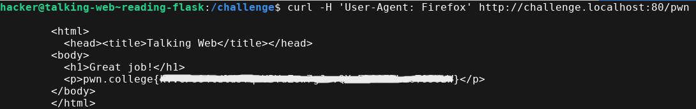


## 3. `Commented Data`

Well, this challenge is just the same as the last one except the flag will be hidden as **comment** in the HTML source code but lucky for us `curl` produces the HTML source code as response so we can just use the same previous technique to solve this challenge.

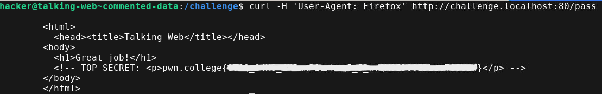


## 4. `HTTP Metadata`

We will use `curl` command along with the `-v` option to check the request and response. The `-v` is for verbosity.

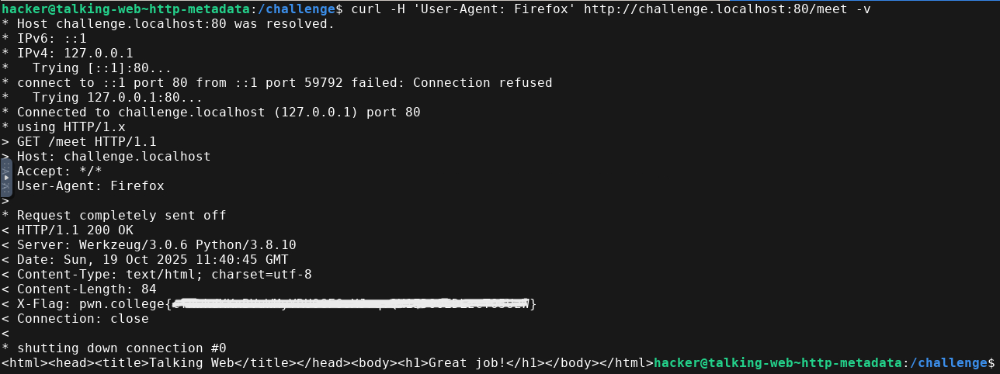


## 5. `HTTP (netcat)`

In this challenge, we need to send **HTTP GET request** to the URL `http://challenge.localhost:80` at endpoint **/** to get the flag. We have to use `netcat` to connect to the target web server and send our request.

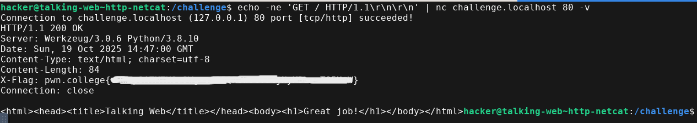

`echo` command is used to send the **HTTP GET request** to the **/** endpoint. `\r\n\r\n` are indicators for the end of the HTTP headers and to make sure they are correctly interpreted as intended I have used the `-e` switch and `-n` to prevent addition of newlines.


## 6. `HTTP Paths(netcat)`

This challenge is just like the previous one with just a different endpoint. The endpoint is **/hack** this time.

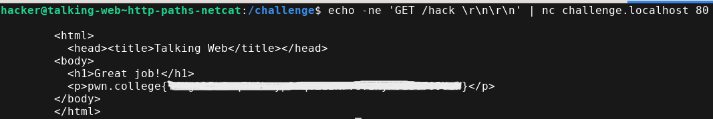


## 7. `HTTP(curl)`

Using `curl` to make HTTP requests to the endpoint **/trial** in the URL `http://challenge.localhost:80`.

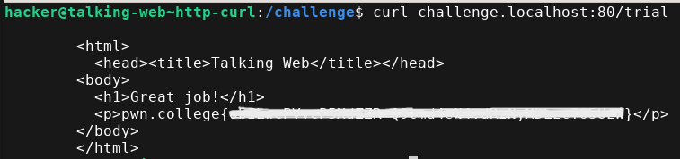


## 8. `HTTP(python)`

We need to send HTTP GET request to the target URL using Python's requests library.

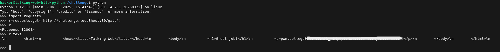


## 9. `HTTP Host Header(python)`

We need to send HTTP get request to the target URL by making changing the host header using python requests library. The host header name will be provided inside the **server** script.

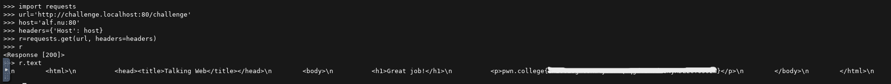


## 10. `HTTP Host Header(curl)`

Same as the previous challenge except we need to use `curl` this time.

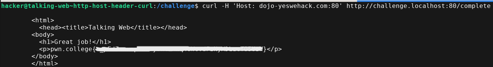


## 11. `HTTP Host Header(netcat)`

Same as the previous challenge except we need to use `netcat` this time. Remember that `netcat` alone will not be sufficient to solve this challenge so you can use `echo` command along with it as well, like I have shown below in the image.

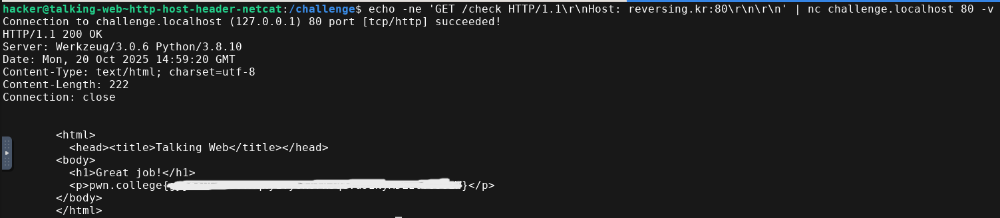


## 12. `URL Encoding(netcat)`

We need to use `netcat` to send HTTP GET request to a URL with the mentioned Host header and also the endpoint for the URL has spaces so we need to provided the correct encoded value of spaces as well.


## 13. `HTTP GET Parameters`

We need to pass a **Query String** in our HTTP GET request to get the challenge flag.

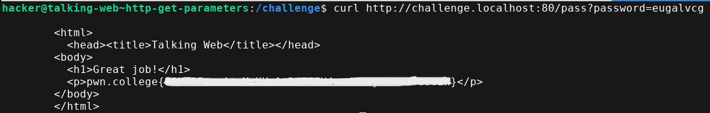


## 14. `Multiple HTTP Parameters(netcat)`

We need to again pass **Query String** in our HTTP GET request but this time there will be multiple query strings so we can append them using **&** symbol. We will use `netcat` for this challenge.

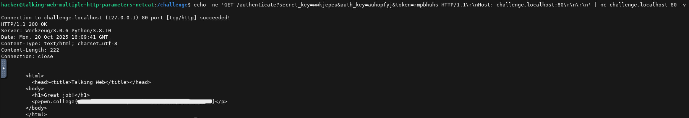


## 15. `Multiple HTTP Parameters(curl)`

We need to pass multiple query string just like the previous challenge using `curl` this time. The shell might interpret the **&** symbol for something else so its better to keep the target URL within quotes.

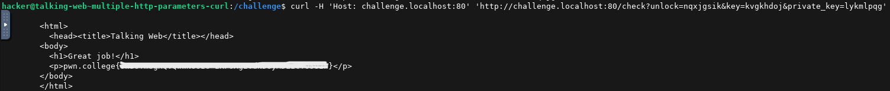


## 16. `HTTP Forms`

We need to send POST request to the server. I am going to use `curl` because its much faster than using the web browser for this challenge. To send POST request using `curl` we use the `-X POST` and since there is a parameter which we need to pass along with the POST request therefore we need to use `-d` option as well.

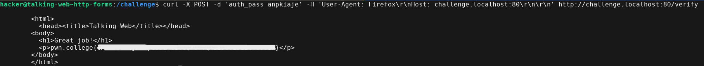


## 17. `HTTP Forms(curl)`

This challenge is actually asking us to solve it via `curl` which I have shown previously. So, its just like the previous one.

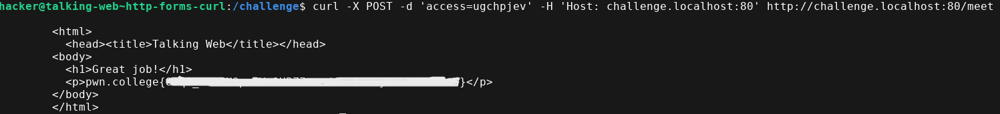


## 18. `HTTP Forms(netcat)`

This one is a bit tricky and honestly a bit frustrating for me. I kept messing up the URL so its better you refer to the link -> [Mozilla](https://developer.mozilla.org/en-US/docs/Web/HTTP/Methods/POST) before forming your POST request URL. This challenge is same as the previous one except for this time we are using `netcat`.

Remember the following things :-
- Mention the Content Length
- Mention the Content Type

I mentioned the above 2 points because you might ignore mentioning them and keep wasting your time trying your URL.

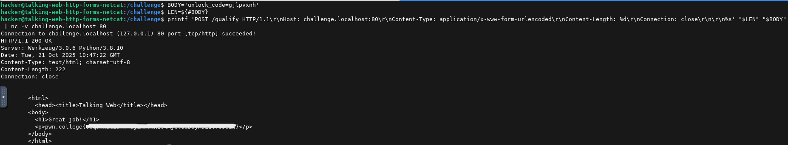


## 19. `HTTP Forms(python)`

We need to send POST request to the target server using Python's requests library. Below is the program how to do this.

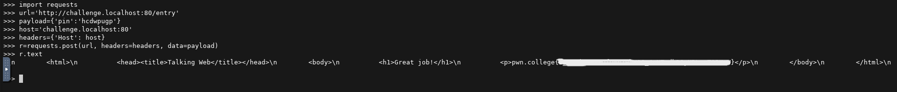


## 20. `HTTP Forms Without Forms`

Sending POST request using `curl` as shown below.

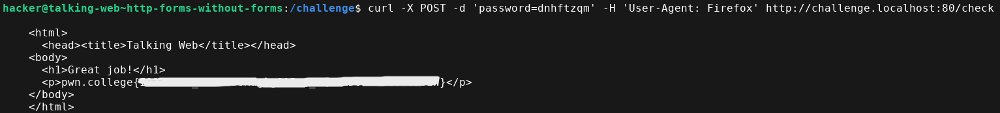


## 21. `HTTP Forms Without Forms(curl)`

Same thing as the previous challenge.

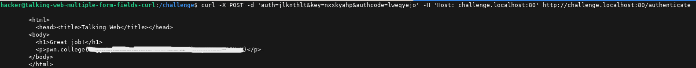


## 22. `HTTP Forms Without Forms(netcat)`

Same this as the previous challenge. This time using `netcat`.

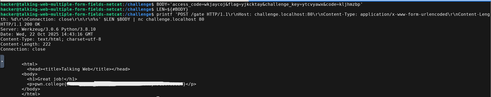


## 23. `HTTP Redirects(netcat)`

We need to make a GET request first and using the `-v` option with `netcat` will show us the response and we will then get the redirect actual endpoint as shown below.

```bash
hacker@talking-web~http-redirects-netcat:/challenge$ echo -ne 'GET / HTTP/1.1\r\nHost: challenge.localhost:80\r\n\r\n' | nc challenge.localhost 80 -v
Connection to challenge.localhost (127.0.0.1) 80 port [tcp/http] succeeded!
HTTP/1.1 302 FOUND
Server: Werkzeug/3.0.6 Python/3.8.10
Date: Thu, 23 Oct 2025 14:54:45 GMT
Content-Type: text/html; charset=utf-8
Content-Length: 221
Location: /wbcYrxAh-fulfill
Connection: close

<!doctype html>
<html lang=en>
<title>Redirecting...</title>
<h1>Redirecting...</h1>
<p>You should be redirected automatically to the target URL: <a href="/wbcYrxAh-fulfill">/wbcYrxAh-fulfill</a>. If not, click the link.
```

Now making GET request to the actual endpoint using `netcat` and getting the flag.

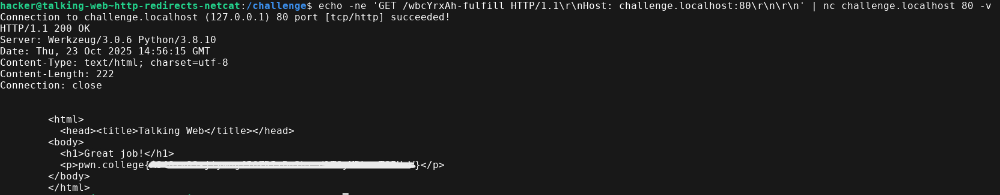


## 24. `HTTP Redirects(curl)`

Doing redirects using `curl` is easier because `curl` has `-L` option which enables us to follow the redirection link. You can also enable the `-v` option to get the response and request info for better clarification.

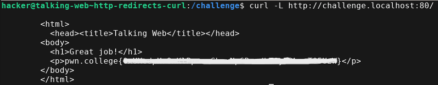 


## 25. `HTTP Redirects(python)`

Using Python's requests library to solve this challenge. Python's requests library will automatically follow up the redirection.

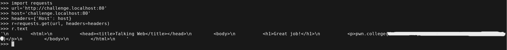


## 26. `HTTP Cookies(curl)`

```bash
hacker@talking-web~http-cookies-curl:/challenge$ ./run
Make an HTTP request to 127.0.0.1 on port 80 to get the flag. Make any HTTP request, and the server will ask you to set a cookie. Make another request with that cookie to get the flag.
You must make this request using the curl command

The following output is from the server, might be useful in helping you debug:
------------------------------------------------
 * Serving Flask app 'run'
 * Debug mode: off
WARNING: This is a development server. Do not use it in a production deployment. Use a production WSGI server instead.
 * Running on http://127.0.0.1:80
Press CTRL+C to quit
```

I executed the script **run** and it clearly states that first we need to make a HTTP request at the target URL `http://127.0.0.1` on port `80` which will give us a **cookie** and we need to use `curl` to **set-cookie** in our HTTP header so that we get the flag. 

```bash
curl http://localhost:80 -v
``` 

We are basically making a HTTP GET request at the target URL and the `-v` option gives us the Response details from the server where we will find our **Cookie**. After that we need to use that cookie to get our flag as shown below.

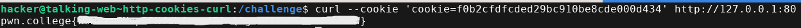


## 27. `HTTP Cookies(netcat)`

Same as the previous challenge but this time using `netcat`. So first we need to send our HTTP GET request to get our cookie value as shown below.

```bash
echo -ne 'GET / HTTP/1.1\r\n\r\n' | nc 127.0.0.1 80
```

After getting the cookie value add it as a header in the HTTP GET request just like last time to get the flag.

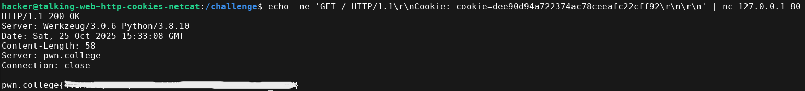


## 28. `HTTP Cookies(python)`

Same as the previous challenge but this time using Python's requests library. 

```python
import requests
url='http://127.0.0.1:80'
r=requests.get(url)
print(r.text)
```

I think there is some problem with the challenge because I only made a HTTP GET request using a simple python program and it generated the flag, I didn't need to set the cookie value.


## 29. `Server State (python)`

	Wrote a basic python script to get the flag just like the last time.

```python
import requests
url='http://127.0.0.1:80'
r=requests.get(url)
print(r.text)
```


## 30. `Listening Web`

I am going to be using `netcat` to solve this challenge. We will use `netcat` to listen for incoming requests from the URL `http://localhost` on port `1337`.

```bash
nc -l -p 1337 -v
```

The `netcat` will listen for incoming requests on that particular port and when you run the challenge script you will get the flag.


## 31. `Speaking Redirects`

We first need to start our **server** program which will listen at `http://challenge.localhost:80/attempt` and we need our **redirection** program to redirect the **client** program from `http://localhost:1337` to the **server** program endpoint. If we are able to perform this redirection then the **client** program will produce the flag.

##### Redirect.py

```python
import socket
s = socket.socket(socket.AF_INET, socket.SOCK_STREAM)
s.bind(('0.0.0.0', 1337))
s.listen(5)
print("Listening on port 1337...")
while True:
    conn, addr = s.accept()
    request = conn.recv(1024)
    print("Received request:", request.decode())
    response = (
        "HTTP/1.1 302 Found\r\n"
        "Location: http://challenge.localhost:80/attempt\r\n"
        "Content-Length: 0\r\n"
        "\r\n\r\n"
    )
    conn.sendall(response.encode())
    conn.close() 
```

Start the **server** program and then the **redirect** program and after that start the **client** program to get the flag. **KEEP 3 TABS OPEN FOR PROPER RESULTS**. After all of this is done checkout the tab where you started the **client** program only if **server** program returns **200 status code**.


## 32. `JavaScript Redirects`

Read the instructions carefully mentioned in the challenge. It states you need to create an HTML find at this location `/home/hacker/public_html/solve.html`. The name provided should be the same as well. Our target is to redirect the **client** program to the `http://challenge.localhost:80/fulfill` endpoint or basically to the location of the **server** program.

We need to write the JavaScript code to cause this redirection. 

#### solve.html

```html
<html>
	<head>
		<title>Redirection</title>
	</head>
	<body>
		<p>Redirection using Javascript!!!</p>
	</body>
	<script>
		window.location.href='http://challenge.localhost:80/fulfill';
	</script>
</html>
```


## 33. `Including JavaScript`

This challenge is a bit trickier than the previous one. We first need to include the external script located at `http://challenge.localhost:80/solve` endpoint into our `solve.html` file and at same location like last time. After loading this script we can access the `flag` variable. We then use the **window.location** object of JavaScript to add this **flag** into our URL where we can redirect the browser and it will print the **flag** at that location.

#### solve.html

```html
<html>
	<head>
		<title>Redirection</title>
	</head>
	<body>
		<p>Redirection using Javascript!!!</p>
	</body>
	<script src='http://challenge.localhost:80/solve'></script>
	<script>
		window.location.href='/home/hacker/public_html/solve.html' + flag;
	</script>
</html>
```

You will find the flag at the window where you executed your **server** script. It will return the status code of **200** along with the flag value with the path of the file where you redirected your program.


## 34. `HTTP JavaScript`

We need to understand how `fetch` in JavaScript works for this. `Fetch` makes HTTP request to the target URL and returns a `promise`. If the `promise` is successful, `.then` part is executed. I made an HTTP request using `fetch` to the target URL `http://challenge.localhost:80/submit` and then use **window.location** object to redirect the flag to the **solve.html** file.

#### solve.html

```html
<html>
	<head>
		<title>Redirection</title>
	</head>
	<body>
		<p>Redirection using Javascript!!!</p>
	</body>
	<script>
		fetch('http://challenge.localhost:80/submit').then(response => response.text()).then(content => window.location.href='/home/hacker/public_html/solve.html'+content);
	</script>
</html>
```


## 35. `HTTP GET Parameters (javascript)`

This challenge is just like the previous one except we need to pass query string along with our HTTP request using JavaScript `fetch`.

#### solve.html

```html
<html>
	<head>
		<title>Redirection</title>
	</head>
	<body>
		<p>Redirection using Javascript!!!</p>
	</body>
	<script>
		fetch('http://challenge.localhost:80/submission?auth_key=ccczdnxi&access=bezsjgfc&verify=rsdltbwa').then(response => response.text()).then(content => window.location.href='/home/hacker/public_html/solve.html'+content);
	</script>
</html>
```


## 36. `HTTP Forms(javascript)`

	We need to send POST request using JavaScript `fetch`.

#### solve.html

```html
<html>
	<head>
		<title>Redirection</title>
	</head>
	<body>
		<p>Redirection using Javascript!!!</p>
	</body>
	<script>
		fetch('http://challenge.localhost:80/hack',{
			method: 'POST',
			body: new URLSearchParams({pin: 'pzzodcbb', code: 'ohrcrevd', challenge_key: 'redeczgy'})
		}).then(response => response.text()).then(content => window.location.href='/home/hacker/public_html/solve.html'+content);
	</script>
</html>
```