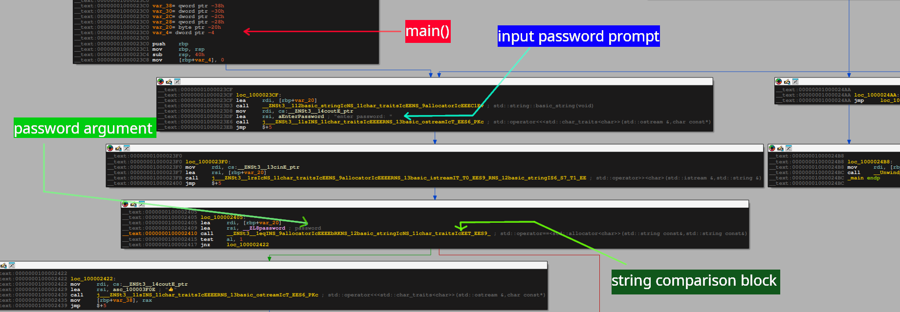
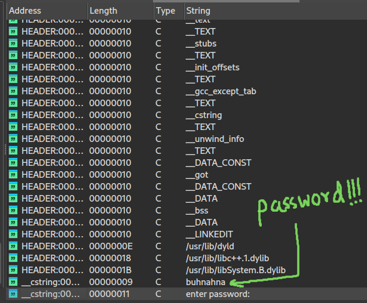

## Binary Information

```
Binary Name => Beginner Friendly
Language => C/C++
Arch => X86X64
Platform => Unix/Linux
```


```bash
$ file main
main: Mach-O 64-bit x86_64 executable, flags:<NOUNDEFS|DYLDLINK|TWOLEVEL|WEAK_DEFINES|BINDS_TO_WEAK|PIE>
```


Mach-O binaries basically run on iOS or Mac devices and since I am using Linux as reversing OS platform I cannot perform dynamic analysis. So static analysis will be performed and explained below how to understand the workflow and reverse engineer the binary.


## Analysis


### Static Analysis

Below is a provided image of the disassembly produced by IDA free 9.2 version in Linux distribution to a rough understanding of the program.



The above image gives us a rough idea about the working of the program.

#### Program Working

- Takes user string input
- Compares the user input with the predefined password string inside the program
- Enters the => "👍" block if the comparison is true

Of course better analysis could be performed but the binary format is not executable in Linux distributions.


## Solving

The crackme challenge can be solved in 2 ways

- Using **IDA** 
- Using **strings** command in Linux


### IDA way

- Open IDA 
- Go View tab
- View tab -> Open subviews -> Strings

Analyze the Strings windows carefully and try to find a unique string.



So the password is **buhnahna** 


### strings command way

```bash
$ strings main
__PAGEZERO
__TEXT
__text
__TEXT
__stubs
__TEXT
__init_offsets
__TEXT
__gcc_except_tab__TEXT
__cstring
__TEXT
__unwind_info
__TEXT
__DATA_CONST
__got
__DATA_CONST
__DATA
__bss
__DATA
__LINKEDIT
/usr/lib/dyld
/usr/lib/libc++.1.dylib
/usr/lib/libSystem.B.dylib
H;A 
H;A 
buhnahna
enter password: 
__Unwind_Resume
__Z7isasciii
__ZNKSt3__16locale9use_facetERNS0_2idE
__ZNKSt3__18ios_base6getlocEv
__ZNSt3__111char_traitsIcE11eq_int_typeEii
__ZNSt3__111char_traitsIcE11to_int_typeEc
__ZNSt3__111char_traitsIcE12to_char_typeEi
__ZNSt3__111char_traitsIcE3eofEv
__ZNSt3__111char_traitsIcE6assignERcRKc
__ZNSt3__111char_traitsIcE6lengthEPKc
__ZNSt3__111char_traitsIcE7compareEPKcS3_m
__ZNSt3__112basic_stringIcNS_11char_traitsIcEENS_9allocatorIcEEE6__initEPKcm
__ZNSt3__112basic_stringIcNS_11char_traitsIcEENS_9allocatorIcEEE6__initEmc
__ZNSt3__112basic_stringIcNS_11char_traitsIcEENS_9allocatorIcEEE9push_backEc
__ZNSt3__112basic_stringIcNS_11char_traitsIcEENS_9allocatorIcEEED1Ev
__ZNSt3__113basic_istreamIcNS_11char_traitsIcEEE6sentryC1ERS3_b
__ZNSt3__113basic_ostreamIcNS_11char_traitsIcEEE3putEc
__ZNSt3__113basic_ostreamIcNS_11char_traitsIcEEE5flushEv
__ZNSt3__113basic_ostreamIcNS_11char_traitsIcEEE6sentryC1ERS3_
__ZNSt3__113basic_ostreamIcNS_11char_traitsIcEEE6sentryD1Ev
__ZNSt3__124__put_character_sequenceIcNS_11char_traitsIcEEEERNS_13basic_ostreamIT_T0_EES7_PKS4_m
__ZNSt3__13cinE
__ZNSt3__14coutE
__ZNSt3__14endlIcNS_11char_traitsIcEEEERNS_13basic_ostreamIT_T0_EES7_
__ZNSt3__15ctypeIcE2idE
__ZNSt3__16localeD1Ev
__ZNSt3__18ios_base33__set_badbit_and_consider_rethrowEv
__ZNSt3__18ios_base5clearEj
__ZNSt3__1lsINS_11char_traitsIcEEEERNS_13basic_ostreamIcT_EES6_PKc
__ZNSt3__1rsIcNS_11char_traitsIcEENS_9allocatorIcEEEERNS_13basic_istreamIT_T0_EES9_RNS_12basic_stringIS6_S7_T1_EE
__ZSt9terminatev
___cxa_atexit
___cxa_begin_catch
___cxa_call_unexpected
___cxa_end_catch
___cxa_rethrow
___gxx_personality_v0
_memcmp
_strlen
7isasciii
NSt3__1
eq_int_typeEii
"to_int_typeEc
'2to_char_typeEi
M3eofEv
7compareEPKcS3_m
assignERcRKc
lengthEPKc
11char_traitsIcE
h24__put_character_sequenceIcNS_11char_traitsIcEEEERNS_13basic_ostreamIT_T0_EES7_PKS4_m
4endlIcNS_11char_traitsIcEEEERNS_13basic_ostreamIT_T0_EES7_
lsINS_11char_traitsIcEEEERNS_13basic_ostreamIcT_EES6_PKc
rsIcNS_11char_traitsIcEENS_9allocatorIcEEEERNS_13basic_istreamIT_T0_EES9_RNS_12basic_stringIS6_S7_T1_EE
mh_execute_header
main
P0 `
0 pp00
 00000 P
P0 0 
`   
000 
p`P 
  000 
    
  Pp 0@
__Z7isasciii
__ZNSt3__111char_traitsIcE11eq_int_typeEii
__ZNSt3__111char_traitsIcE11to_int_typeEc
__ZNSt3__111char_traitsIcE12to_char_typeEi
__ZNSt3__111char_traitsIcE3eofEv
__ZNSt3__111char_traitsIcE6assignERcRKc
__ZNSt3__111char_traitsIcE6lengthEPKc
__ZNSt3__111char_traitsIcE7compareEPKcS3_m
__ZNSt3__124__put_character_sequenceIcNS_11char_traitsIcEEEERNS_13basic_ostreamIT_T0_EES7_PKS4_m
__ZNSt3__14endlIcNS_11char_traitsIcEEEERNS_13basic_ostreamIT_T0_EES7_
__ZNSt3__1lsINS_11char_traitsIcEEEERNS_13basic_ostreamIcT_EES6_PKc
__ZNSt3__1rsIcNS_11char_traitsIcEENS_9allocatorIcEEEERNS_13basic_istreamIT_T0_EES9_RNS_12basic_stringIS6_S7_T1_EE
__mh_execute_header
_main
__Unwind_Resume
__ZNKSt3__16locale9use_facetERNS0_2idE
__ZNKSt3__18ios_base6getlocEv
__ZNSt3__112basic_stringIcNS_11char_traitsIcEENS_9allocatorIcEEE6__initEPKcm
__ZNSt3__112basic_stringIcNS_11char_traitsIcEENS_9allocatorIcEEE6__initEmc
__ZNSt3__112basic_stringIcNS_11char_traitsIcEENS_9allocatorIcEEE9push_backEc
__ZNSt3__112basic_stringIcNS_11char_traitsIcEENS_9allocatorIcEEED1Ev
__ZNSt3__113basic_istreamIcNS_11char_traitsIcEEE6sentryC1ERS3_b
__ZNSt3__113basic_ostreamIcNS_11char_traitsIcEEE3putEc
__ZNSt3__113basic_ostreamIcNS_11char_traitsIcEEE5flushEv
__ZNSt3__113basic_ostreamIcNS_11char_traitsIcEEE6sentryC1ERS3_
__ZNSt3__113basic_ostreamIcNS_11char_traitsIcEEE6sentryD1Ev
__ZNSt3__13cinE
__ZNSt3__14coutE
__ZNSt3__15ctypeIcE2idE
__ZNSt3__16localeD1Ev
__ZNSt3__18ios_base33__set_badbit_and_consider_rethrowEv
__ZNSt3__18ios_base5clearEj
__ZSt9terminatev
___cxa_atexit
___cxa_begin_catch
___cxa_call_unexpected
___cxa_end_catch
___cxa_rethrow
___gxx_personality_v0
_memcmp
_strlen
__ZNSt3__112basic_stringIcNS_11char_traitsIcEENS_9allocatorIcEEEC1INS_9nullptr_tEEEPKc
__ZNSt3__112basic_stringIcNS_11char_traitsIcEENS_9allocatorIcEEEC1Ev
__ZNSt3__1eqINS_9allocatorIcEEEEbRKNS_12basic_stringIcNS_11char_traitsIcEET_EES9_
__ZNSt3__113basic_ostreamIcNS_11char_traitsIcEEElsEPFRS3_S4_E
___clang_call_terminate
__ZNSt3__112basic_stringIcNS_11char_traitsIcEENS_9allocatorIcEEEC2INS_9nullptr_tEEEPKc
__ZNSt3__117__compressed_pairINS_12basic_stringIcNS_11char_traitsIcEENS_9allocatorIcEEE5__repES5_EC1INS_18__default_init_tagESA_EEOT_OT0_
__ZNSt3__117__compressed_pairINS_12basic_stringIcNS_11char_traitsIcEENS_9allocatorIcEEE5__repES5_EC2INS_18__default_init_tagESA_EEOT_OT0_
__ZNSt3__1L7forwardINS_18__default_init_tagEEEOT_RNS_16remove_referenceIS2_E4typeE
__ZNSt3__122__compressed_pair_elemINS_12basic_stringIcNS_11char_traitsIcEENS_9allocatorIcEEE5__repELi0ELb0EEC2ENS_18__default_init_tagE
__ZNSt3__122__compressed_pair_elemINS_9allocatorIcEELi1ELb1EEC2ENS_18__default_init_tagE
__ZNSt3__19allocatorIcEC2Ev
__ZNSt3__116__non_trivial_ifILb1ENS_9allocatorIcEEEC2Ev
__ZNSt3__112basic_stringIcNS_11char_traitsIcEENS_9allocatorIcEEEC2Ev
__ZNSt3__112basic_stringIcNS_11char_traitsIcEENS_9allocatorIcEEE6__zeroEv
__ZNSt3__117__compressed_pairINS_12basic_stringIcNS_11char_traitsIcEENS_9allocatorIcEEE5__repES5_E5firstEv
__ZNSt3__122__compressed_pair_elemINS_12basic_stringIcNS_11char_traitsIcEENS_9allocatorIcEEE5__repELi0ELb0EE5__getEv
__ZNKSt3__113basic_ostreamIcNS_11char_traitsIcEEE6sentrycvbEv
__ZNSt3__116__pad_and_outputIcNS_11char_traitsIcEEEENS_19ostreambuf_iteratorIT_T0_EES6_PKS4_S8_S8_RNS_8ios_baseES4_
__ZNSt3__119ostreambuf_iteratorIcNS_11char_traitsIcEEEC1ERNS_13basic_ostreamIcS2_EE
__ZNKSt3__18ios_base5flagsEv
__ZNKSt3__19basic_iosIcNS_11char_traitsIcEEE4fillEv
__ZNKSt3__119ostreambuf_iteratorIcNS_11char_traitsIcEEE6failedEv
__ZNSt3__19basic_iosIcNS_11char_traitsIcEEE8setstateEj
__ZNSt3__1L15__get_nullptr_tEv
__ZNKSt3__19nullptr_tcvPT_INS_15basic_streambufIcNS_11char_traitsIcEEEEEEv
__ZNKSt3__18ios_base5widthEv
__ZNSt3__115basic_streambufIcNS_11char_traitsIcEEE5sputnEPKcl
__ZNSt3__112basic_stringIcNS_11char_traitsIcEENS_9allocatorIcEEEC1Emc
__ZNKSt3__112basic_stringIcNS_11char_traitsIcEENS_9allocatorIcEEE4dataEv
__ZNSt3__18ios_base5widthEl
__ZNSt3__19nullptr_tC1EMNS0_5__natEi
__ZNSt3__19nullptr_tC2EMNS0_5__natEi
__ZNSt3__112basic_stringIcNS_11char_traitsIcEENS_9allocatorIcEEEC2Emc
__ZNSt3__1L12__to_addressIKcEEPT_S3_
__ZNKSt3__112basic_stringIcNS_11char_traitsIcEENS_9allocatorIcEEE13__get_pointerEv
__ZNKSt3__112basic_stringIcNS_11char_traitsIcEENS_9allocatorIcEEE9__is_longEv
__ZNKSt3__112basic_stringIcNS_11char_traitsIcEENS_9allocatorIcEEE18__get_long_pointerEv
__ZNKSt3__112basic_stringIcNS_11char_traitsIcEENS_9allocatorIcEEE19__get_short_pointerEv
__ZNKSt3__117__compressed_pairINS_12basic_stringIcNS_11char_traitsIcEENS_9allocatorIcEEE5__repES5_E5firstEv
__ZNKSt3__122__compressed_pair_elemINS_12basic_stringIcNS_11char_traitsIcEENS_9allocatorIcEEE5__repELi0ELb0EE5__getEv
__ZNSt3__114pointer_traitsIPKcE10pointer_toERS1_
__ZNSt3__1L9addressofIKcEEPT_RS2_
__ZNSt3__119ostreambuf_iteratorIcNS_11char_traitsIcEEEC2ERNS_13basic_ostreamIcS2_EE
__ZNKSt3__19basic_iosIcNS_11char_traitsIcEEE5rdbufEv
__ZNKSt3__18ios_base5rdbufEv
__ZNKSt3__19basic_iosIcNS_11char_traitsIcEEE5widenEc
__ZNSt3__1L9use_facetINS_5ctypeIcEEEERKT_RKNS_6localeE
__ZNKSt3__15ctypeIcE5widenEc
__ZNSt3__18ios_base8setstateEj
__ZNKSt3__113basic_istreamIcNS_11char_traitsIcEEE6sentrycvbEv
__ZNSt3__112basic_stringIcNS_11char_traitsIcEENS_9allocatorIcEEE5clearEv
__ZNKSt3__112basic_stringIcNS_11char_traitsIcEENS_9allocatorIcEEE8max_sizeEv
__ZNSt3__114numeric_limitsIlE3maxEv
__ZNSt3__115basic_streambufIcNS_11char_traitsIcEEE5sgetcEv
__ZNKSt3__15ctypeIcE2isEjc
__ZNSt3__115basic_streambufIcNS_11char_traitsIcEEE6sbumpcEv
__ZNSt3__18ios_base18__setstate_nothrowEj
__ZNKSt3__19basic_iosIcNS_11char_traitsIcEEE10exceptionsEv
__ZNSt3__112basic_stringIcNS_11char_traitsIcEENS_9allocatorIcEEE26__invalidate_all_iteratorsEv
__ZNSt3__112basic_stringIcNS_11char_traitsIcEENS_9allocatorIcEEE18__get_long_pointerEv
__ZNSt3__112basic_stringIcNS_11char_traitsIcEENS_9allocatorIcEEE15__set_long_sizeEm
__ZNSt3__112basic_stringIcNS_11char_traitsIcEENS_9allocatorIcEEE19__get_short_pointerEv
__ZNSt3__112basic_stringIcNS_11char_traitsIcEENS_9allocatorIcEEE16__set_short_sizeEm
__ZNSt3__114pointer_traitsIPcE10pointer_toERc
__ZNSt3__1L9addressofIcEEPT_RS1_
__ZNSt3__116allocator_traitsINS_9allocatorIcEEE8max_sizeIS2_vEEmRKS2_
__ZNKSt3__112basic_stringIcNS_11char_traitsIcEENS_9allocatorIcEEE7__allocEv
__ZNKSt3__19allocatorIcE8max_sizeEv
__ZNKSt3__117__compressed_pairINS_12basic_stringIcNS_11char_traitsIcEENS_9allocatorIcEEE5__repES5_E6secondEv
__ZNKSt3__122__compressed_pair_elemINS_9allocatorIcEELi1ELb1EE5__getEv
__ZNSt3__123__libcpp_numeric_limitsIlLb1EE3maxEv
__ZNKSt3__18ios_base10exceptionsEv
__ZNKSt3__112basic_stringIcNS_11char_traitsIcEENS_9allocatorIcEEE4sizeEv
__ZNKSt3__112basic_stringIcNS_11char_traitsIcEENS_9allocatorIcEEE15__get_long_sizeEv
__ZNKSt3__112basic_stringIcNS_11char_traitsIcEENS_9allocatorIcEEE16__get_short_sizeEv
___cxx_global_var_init
__GLOBAL__sub_I_main.cxx
GCC_except_table2
GCC_except_table5
GCC_except_table23
GCC_except_table25
GCC_except_table29
GCC_except_table50
GCC_except_table55
GCC_except_table60
GCC_except_table87
__ZL8password
```