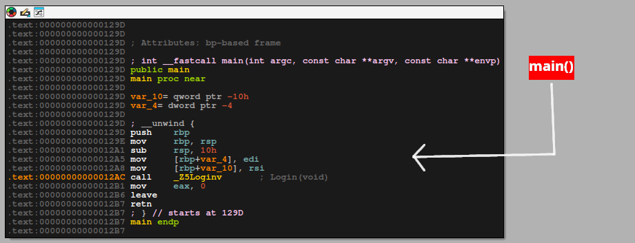
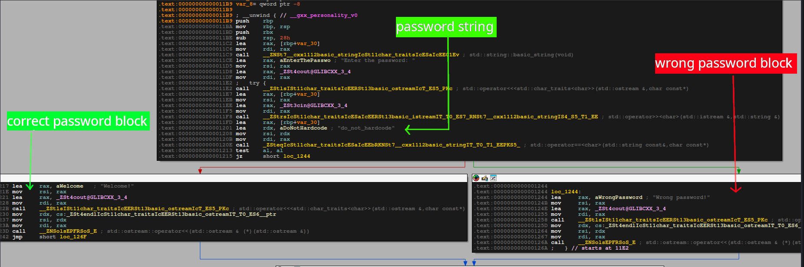
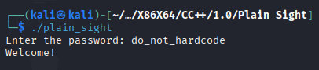

## Binary Information

```
Binary Name => Plain Sight
Language => C/C++
Arch => X86X64
Platform => Unix/Linux
```


```bash
$ file plain_sight
plain_sight: ELF 64-bit LSB pie executable, x86-64, version 1 (SYSV), dynamically linked, interpreter /lib64/ld-linux-x86-64.so.2, BuildID[sha1]=48e0a7b04cce9f3b0a3460de3ab5faeba2655625, for GNU/Linux 3.2.0, not stripped
```


## Analysis

I have done the analysis of the binary using IDA free 9.2 version in the Linux system.

### Static Analysis

Below is the disassembly of the main function of the program, where we call it calls a function.




This function basically performs all the logical operations to check whether the supplied string is correct or wrong. Below is the disassembly and program workflow of how the correct or incorrect string we supply are processed



I have intentionally highlighted the important parts of the disassembly. Check the passing string **that is basically our password**. If we supply the correct password the **correct password block** is executed and we get the **Welcome!** as stdout otherwise the **wrong password block** is executed and the program exits with the message **Wrong password!**. 


## Testing our input

Now lets check what happens if we supply the "**do_not_hardcode**" string as our user input. 



Yes!!! we were able to crack the binary. 