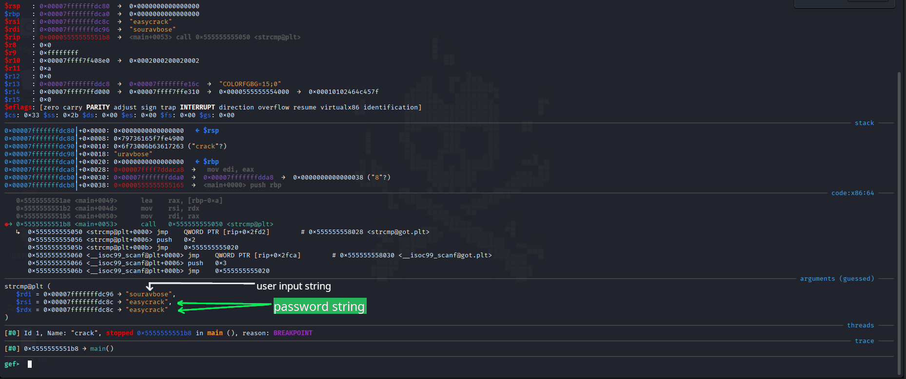

## Binary Information

```
Binary Name => PrettyDamnEasy
Language => C/C++
Arch => x86x64
Platform => Unix/Linux
```

```bash
$ file crack
crack: ELF 64-bit LSB pie executable, x86-64, version 1 (SYSV), dynamically linked, interpreter /lib64/ld-linux-x86-64.so.2, for GNU/Linux 3.2.0, BuildID[sha1]=d9493670838135ebf0702a258f67982f62427900, not stripped
```


## Analysis


### Static Analysis

Below is the disassembly of the **main()** function of the binary and I also have examined the binary strings.

```bash
gef➤  disass main
Dump of assembler code for function main:
   0x0000000000001165 <+0>:     push   rbp
   0x0000000000001166 <+1>:     mov    rbp,rsp
   0x0000000000001169 <+4>:     sub    rsp,0x20
   0x000000000000116d <+8>:     movabs rax,0x6361726379736165
   0x0000000000001177 <+18>:    mov    QWORD PTR [rbp-0x14],rax
   0x000000000000117b <+22>:    mov    WORD PTR [rbp-0xc],0x6b
   0x0000000000001181 <+28>:    lea    rdi,[rip+0xe7c]        # 0x2004
   0x0000000000001188 <+35>:    mov    eax,0x0
   0x000000000000118d <+40>:    call   0x1040 <printf@plt>
   0x0000000000001192 <+45>:    lea    rax,[rbp-0xa]
   0x0000000000001196 <+49>:    mov    rsi,rax
   0x0000000000001199 <+52>:    lea    rdi,[rip+0xe7a]        # 0x201a
   0x00000000000011a0 <+59>:    mov    eax,0x0
   0x00000000000011a5 <+64>:    call   0x1060 <__isoc99_scanf@plt>
   0x00000000000011aa <+69>:    lea    rdx,[rbp-0x14]
   0x00000000000011ae <+73>:    lea    rax,[rbp-0xa]
   0x00000000000011b2 <+77>:    mov    rsi,rdx
   0x00000000000011b5 <+80>:    mov    rdi,rax
   0x00000000000011b8 <+83>:    call   0x1050 <strcmp@plt>
   0x00000000000011bd <+88>:    test   eax,eax
   0x00000000000011bf <+90>:    jne    0x11d4 <main+111>
   0x00000000000011c1 <+92>:    lea    rdi,[rip+0xe55]        # 0x201d
   0x00000000000011c8 <+99>:    mov    eax,0x0
   0x00000000000011cd <+104>:   call   0x1040 <printf@plt>
   0x00000000000011d2 <+109>:   jmp    0x11e5 <main+128>
   0x00000000000011d4 <+111>:   lea    rdi,[rip+0xe53]        # 0x202e
   0x00000000000011db <+118>:   mov    eax,0x0
   0x00000000000011e0 <+123>:   call   0x1040 <printf@plt>
   0x00000000000011e5 <+128>:   mov    edi,0xa
   0x00000000000011ea <+133>:   call   0x1030 <putchar@plt>
   0x00000000000011ef <+138>:   mov    eax,0x0
   0x00000000000011f4 <+143>:   leave
   0x00000000000011f5 <+144>:   ret
End of assembler dump.
gef➤  x/s 0x2004
0x2004: "\nInput the password: "
gef➤  x/s 0x201a
0x201a: "%s"
gef➤  x/s 0x201d
0x201d: "Correct password"
gef➤  x/s 0x202e
0x202e: "Wrong password, try another"
gef➤   
```


#### Program Workflow

- Takes user input string (**found %s by examining 0x201a**).
- Checks if the string is correct or wrong.
- If string is correct then it prints **Correct password** else **Wrong password, try another**.


### Dynamic Analysis

Now you need to setup to 2 breakpoints 

- One breakpoint at **main()**
- Another breakpoint at **(strcmp@plt)** function. 
- Make sure you have already run the **main()** method or the program before setting the 2nd breakpoint since the binary is dynamically linked so the addresses will not be valid if you setup breakpoint early on.
- After setting the 2 breakpoints continue the program and check the **rdi and rsi** registers.



- So, we have got out password now let's test it.


## Testing our input

```bash
 ./crack

Input the password: easycrack
Correct password
```

Great!!! we were able to crack this crackme by checking the function arguments value.


