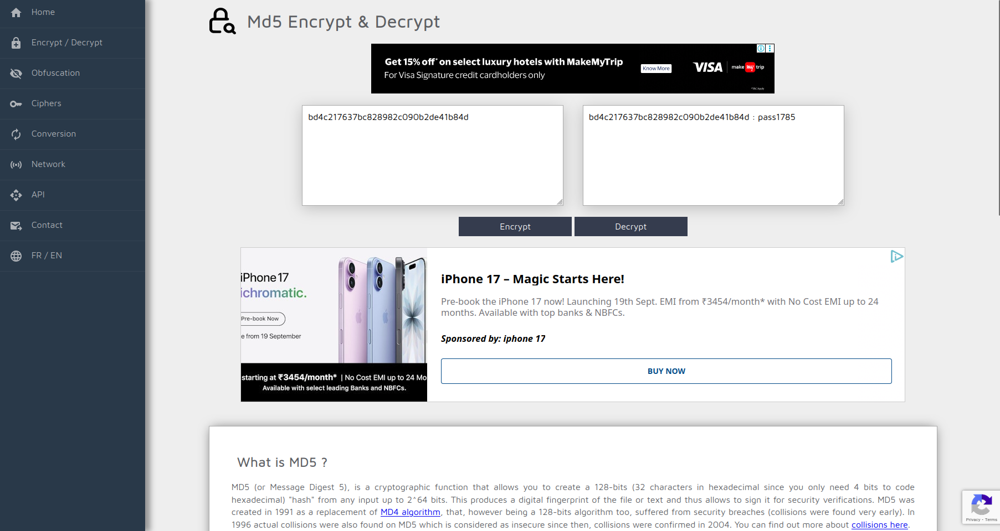

## Binary Information

```
Binary Name => Simple crackme
Language => C/C++
Arch => x86x64
Platform => Unix/Linux
```


```bash
$ file crackme
crackme: ELF 64-bit LSB pie executable, x86-64, version 1 (SYSV), dynamically linked, interpreter /lib64/ld-linux-x86-64.so.2, BuildID[sha1]=1e0d463a818b87940b6b0f472c2ec6276af79583, for GNU/Linux 3.2.0, stripped
```

### Basic Workflow

- The program takes user key input
- Compares user key input with its own original key
- If the comparison fails it prints **try again!**


### Finding the key

```bash
$ ltrace ./crackme
printf("Enter key: ")                                                                                                                        = 11
__isoc99_scanf(0x556905c42010, 0x7ffe0cb78620, 0, 0Enter key: sourav
)                                                                                         = 1
strcmp("sourav", "bd4c217637bc828982c090b2de41b84d"...)                                                                                      = 17
puts("try again!"try again!
)                                                                                                                           = 11
+++ exited (status 0) +++

$ ./crackme
Enter key: bd4c217637bc828982c090b2de41b84d
good job!
```


I gave a random input at first and **ltrace** command was able to trace the library function calls made and we can see it loaded the user input as **args1** and the original key as **args2**. Of course we failed at first since we were just testing but on the next time I gave the original key value and was able to crack the crackme!!!


### Decrypting the hash




So the password is **pass1785**.

### Objectives

a) Find the key (DONE!!!)✅
b) Find the Easter egg and decrypt - https://md5decrypt.net/en/ Have fun!) (DONE!!!)✅


