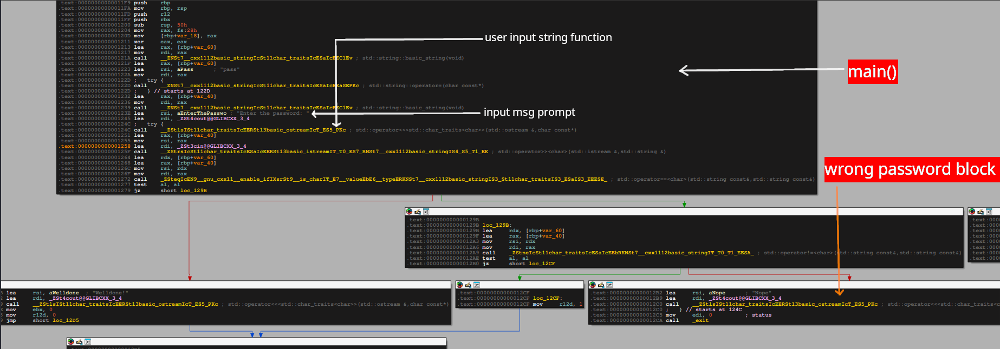
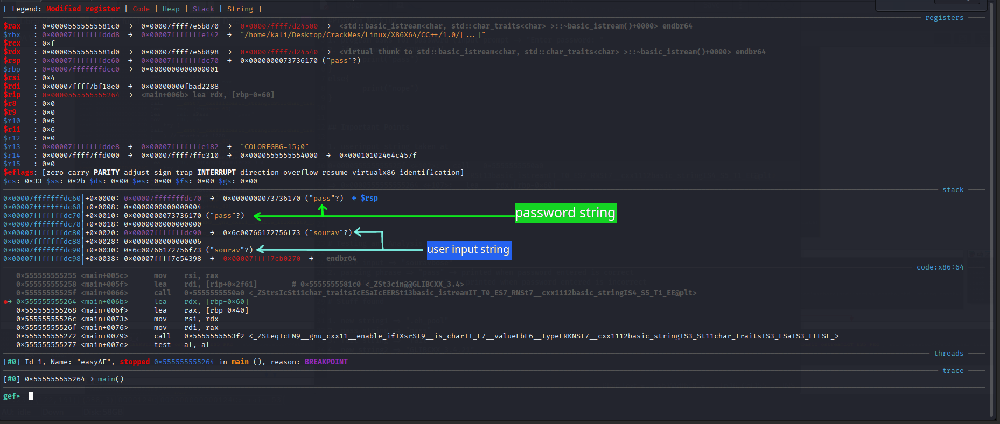
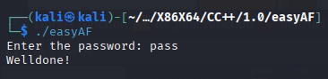

## Binary Information

```
Binary Name => easyAF
Language => C/C++
Arch => x86x64
Platform => Unix/Linux
```

```bash
$ file easyAF
easyAF: ELF 64-bit LSB pie executable, x86-64, version 1 (SYSV), dynamically linked, interpreter /lib64/ld-linux-x86-64.so.2, BuildID[sha1]=c1f484166af165c71e71e8e0e5ebd8f9d6300f0a, for GNU/Linux 3.2.0, not stripped
```

### Basic Workflow

- The program takes user string input
- Compares the user input string with its predefined string 
- If our user input string is correct then **WellDone!** is printed otherwise **Nope**

Below is the picture to demonstrate the above **Basic Overflow** is a visual way.




## Analysis

I solved this crackme using gdb + gef(plugin).

### Dynamic Analysis

The level was solved with a bit of hunch and dynamically analyzing what arguments or strings were loaded in the registers when function calls were made. Analyzing the stack gave me a pretty good idea what the password would be. Below is how I came to this conclusion.

I setup a breakpoint at **main** and then ran the program.

```gdb
gef➤  disass main
Dump of assembler code for function main:
   0x00005555555551f9 <+0>:     push   rbp
   0x00005555555551fa <+1>:     mov    rbp,rsp
=> 0x00005555555551fd <+4>:     push   r12
   0x00005555555551ff <+6>:     push   rbx
   0x0000555555555200 <+7>:     sub    rsp,0x50
   0x0000555555555204 <+11>:    mov    rax,QWORD PTR fs:0x28
   0x000055555555520d <+20>:    mov    QWORD PTR [rbp-0x18],rax
   0x0000555555555211 <+24>:    xor    eax,eax
   0x0000555555555213 <+26>:    lea    rax,[rbp-0x60]
   0x0000555555555217 <+30>:    mov    rdi,rax
   0x000055555555521a <+33>:    call   0x5555555550d0 <_ZNSt7__cxx1112basic_stringIcSt11char_traitsIcESaIcEEC1Ev@plt>
   0x000055555555521f <+38>:    lea    rax,[rbp-0x60]
   0x0000555555555223 <+42>:    lea    rsi,[rip+0xddb]        # 0x555555556005
   0x000055555555522a <+49>:    mov    rdi,rax
   0x000055555555522d <+52>:    call   0x5555555550c0 <_ZNSt7__cxx1112basic_stringIcSt11char_traitsIcESaIcEEaSEPKc@plt>
   0x0000555555555232 <+57>:    lea    rax,[rbp-0x40]
   0x0000555555555236 <+61>:    mov    rdi,rax
   0x0000555555555239 <+64>:    call   0x5555555550d0 <_ZNSt7__cxx1112basic_stringIcSt11char_traitsIcESaIcEEC1Ev@plt>
   0x000055555555523e <+69>:    lea    rsi,[rip+0xdc5]        # 0x55555555600a
   0x0000555555555245 <+76>:    lea    rdi,[rip+0x2e54]        # 0x5555555580a0 <_ZSt4cout@@GLIBCXX_3.4>
   0x000055555555524c <+83>:    call   0x555555555070 <_ZStlsISt11char_traitsIcEERSt13basic_ostreamIcT_ES5_PKc@plt>
   0x0000555555555251 <+88>:    lea    rax,[rbp-0x40]
   0x0000555555555255 <+92>:    mov    rsi,rax
   0x0000555555555258 <+95>:    lea    rdi,[rip+0x2f61]        # 0x5555555581c0 <_ZSt3cin@@GLIBCXX_3.4>
   0x000055555555525f <+102>:   call   0x5555555550a0 <_ZStrsIcSt11char_traitsIcESaIcEERSt13basic_istreamIT_T0_ES7_RNSt7__cxx1112basic_stringIS4_S5_T1_EE@plt>
   0x0000555555555264 <+107>:   lea    rdx,[rbp-0x60]
   0x0000555555555268 <+111>:   lea    rax,[rbp-0x40]
   0x000055555555526c <+115>:   mov    rsi,rdx
   0x000055555555526f <+118>:   mov    rdi,rax
   0x0000555555555272 <+121>:   call   0x5555555553f2 <_ZSteqIcEN9__gnu_cxx11__enable_ifIXsrSt9__is_charIT_E7__valueEbE6__typeERKNSt7__cxx1112basic_stringIS3_St11char_traitsIS3_ESaIS3_EEESE_>
   0x0000555555555277 <+126>:   test   al,al
   0x0000555555555279 <+128>:   je     0x55555555529b <main+162>
   0x000055555555527b <+130>:   lea    rsi,[rip+0xd9d]        # 0x55555555601f
   0x0000555555555282 <+137>:   lea    rdi,[rip+0x2e17]        # 0x5555555580a0 <_ZSt4cout@@GLIBCXX_3.4>
   0x0000555555555289 <+144>:   call   0x555555555070 <_ZStlsISt11char_traitsIcEERSt13basic_ostreamIcT_ES5_PKc@plt>
   0x000055555555528e <+149>:   mov    ebx,0x0
   0x0000555555555293 <+154>:   mov    r12d,0x0
   0x0000555555555299 <+160>:   jmp    0x5555555552d5 <main+220>
   0x000055555555529b <+162>:   lea    rdx,[rbp-0x60]
   0x000055555555529f <+166>:   lea    rax,[rbp-0x40]
   0x00005555555552a3 <+170>:   mov    rsi,rdx
   0x00005555555552a6 <+173>:   mov    rdi,rax
   0x00005555555552a9 <+176>:   call   0x555555555476 <_ZStneIcSt11char_traitsIcESaIcEEbRKNSt7__cxx1112basic_stringIT_T0_T1_EESA_>
   0x00005555555552ae <+181>:   test   al,al
   0x00005555555552b0 <+183>:   je     0x5555555552cf <main+214>
   0x00005555555552b2 <+185>:   lea    rsi,[rip+0xd70]        # 0x555555556029
   0x00005555555552b9 <+192>:   lea    rdi,[rip+0x2de0]        # 0x5555555580a0 <_ZSt4cout@@GLIBCXX_3.4>
   0x00005555555552c0 <+199>:   call   0x555555555070 <_ZStlsISt11char_traitsIcEERSt13basic_ostreamIcT_ES5_PKc@plt>
   0x00005555555552c5 <+204>:   mov    edi,0x0
   0x00005555555552ca <+209>:   call   0x555555555090 <exit@plt>
   0x00005555555552cf <+214>:   mov    r12d,0x1
   0x00005555555552d5 <+220>:   lea    rax,[rbp-0x40]
   0x00005555555552d9 <+224>:   mov    rdi,rax
   0x00005555555552dc <+227>:   call   0x555555555040 <_ZNSt7__cxx1112basic_stringIcSt11char_traitsIcESaIcEED1Ev@plt>
   0x00005555555552e1 <+232>:   cmp    r12d,0x1
   0x00005555555552e5 <+236>:   je     0x5555555552ef <main+246>
   0x00005555555552e7 <+238>:   mov    r12d,0x0
   0x00005555555552ed <+244>:   jmp    0x5555555552f5 <main+252>
   0x00005555555552ef <+246>:   mov    r12d,0x1
   0x00005555555552f5 <+252>:   lea    rax,[rbp-0x60]
   0x00005555555552f9 <+256>:   mov    rdi,rax
   0x00005555555552fc <+259>:   call   0x555555555040 <_ZNSt7__cxx1112basic_stringIcSt11char_traitsIcESaIcEED1Ev@plt>
   0x0000555555555301 <+264>:   cmp    r12d,0x1
   0x0000555555555305 <+268>:   jne    0x55555555530c <main+275>
   0x0000555555555307 <+270>:   mov    ebx,0x0
   0x000055555555530c <+275>:   mov    eax,ebx
   0x000055555555530e <+277>:   mov    rcx,QWORD PTR [rbp-0x18]
   0x0000555555555312 <+281>:   xor    rcx,QWORD PTR fs:0x28
   0x000055555555531b <+290>:   je     0x55555555534f <main+342>
   0x000055555555531d <+292>:   jmp    0x55555555534a <main+337>
   0x000055555555531f <+294>:   mov    rbx,rax
   0x0000555555555322 <+297>:   lea    rax,[rbp-0x40]
   0x0000555555555326 <+301>:   mov    rdi,rax
   0x0000555555555329 <+304>:   call   0x555555555040 <_ZNSt7__cxx1112basic_stringIcSt11char_traitsIcESaIcEED1Ev@plt>
   0x000055555555532e <+309>:   jmp    0x555555555333 <main+314>
   0x0000555555555330 <+311>:   mov    rbx,rax
   0x0000555555555333 <+314>:   lea    rax,[rbp-0x60]
   0x0000555555555337 <+318>:   mov    rdi,rax
   0x000055555555533a <+321>:   call   0x555555555040 <_ZNSt7__cxx1112basic_stringIcSt11char_traitsIcESaIcEED1Ev@plt>
   0x000055555555533f <+326>:   mov    rax,rbx
   0x0000555555555342 <+329>:   mov    rdi,rax
   0x0000555555555345 <+332>:   call   0x5555555550f0 <_Unwind_Resume@plt>
   0x000055555555534a <+337>:   call   0x555555555080 <__stack_chk_fail@plt>
   0x000055555555534f <+342>:   add    rsp,0x50
   0x0000555555555353 <+346>:   pop    rbx
   0x0000555555555354 <+347>:   pop    r12
   0x0000555555555356 <+349>:   pop    rbp
   0x0000555555555357 <+350>:   ret
End of assembler dump.
gef➤  b *0x0000555555555264
Breakpoint 2 at 0x555555555264
gef➤  
```

I set up a breakpoint after the user input string was taken and then I figured I will check the stack for what happens next before any further function calls are made.
**NOTE: before setting the breakpoint make sure you have run the main() or started the program otherwise the address won't load. This address is dynamically linked so setting breakpoint statically will be designated as invalid when the program will be executed**.

After setting the breakpoint, I continued execution of the program and it prompted for password input.



Check the stack condition and you will figure out the password by yourself only. Now after finding the password string its best to exit from the debugger and test our discovered password string.


## Testing



We were able to successfully crack **easyAF** crackme.