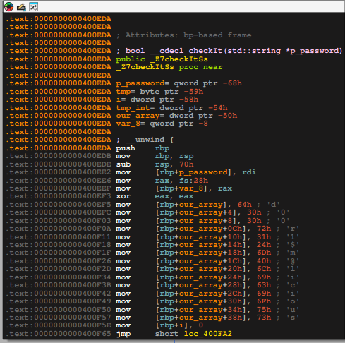

## Binary Information

```
Binary Name => eyecandylocked
Language => C/C++
Arch => x86x64
Platform => Unix/Linux
```

```bash
$ file EyeCandyLOCKED
EyeCandyLOCKED: ELF 64-bit LSB executable, x86-64, version 1 (SYSV), dynamically linked, interpreter /lib64/ld-linux-x86-64.so.2, for GNU/Linux 2.6.32, BuildID[sha1]=a2f07f96d62e5485980091b97aea74ddbe54648e, with debug_info, not stripped
```


## Analysis


### main() decompiled code

Below is the decompiled code of **main()** method by Ghidra.

```c
int main(void)

{
  bool bVar1;
  long lVar2;
  ostream *poVar3;
  long in_FS_OFFSET;
  string password;
  string local_68 [2];
  string local_58 [2];
  string local_48 [2];
  string local_38 [2];
  string local_28;
  long local_20;
  
  local_20 = *(long *)(in_FS_OFFSET + 0x28);
  std::allocator<char>::allocator();
                    /* try { // try from 00400ff7 to 00400ffb has its CatchHandler @ 0040127c */
  std::string::string(&password,"",(allocator *)&local_28);
  std::allocator<char>::~allocator((allocator<char> *)&local_28);
                    /* try { // try from 0040100d to 00401062 has its CatchHandler @ 0040132f */
  putchar(10);
  lVar2 = ptrace(PTRACE_TRACEME,0,1,0);
  if (lVar2 < 0) {
    poVar3 = std::operator<<((ostream *)std::cout,
                             "Did you really think that you can mess around with me?!");
    std::ostream::operator<<((ostream *)poVar3,std::endl<>);
    std::operator<<((ostream *)std::cout,
                    "I am a \'crack me\' program for God\'s sake.. Debugging tools like that..?\nSho w some respect ;)\n\nOutta here."
                   );
  }
  else {
    while( true ) {
      std::allocator<char>::allocator();
                    /* try { // try from 00401089 to 0040108d has its CatchHandler @ 004012a7 */
      std::string::string(local_68,"*** THE DOOR IS LOCKED! ***\n\n",(allocator *)&local_28);
                    /* try { // try from 00401095 to 00401099 has its CatchHandler @ 00401296 */
      print_center(local_68);
                    /* try { // try from 004010a1 to 004010a5 has its CatchHandler @ 004012a7 */
      std::string::~string(local_68);
      std::allocator<char>::~allocator((allocator<char> *)&local_28);
                    /* try { // try from 004010bc to 004010fd has its CatchHandler @ 0040132f */
      std::operator<<((ostream *)std::cout,"Gimme your password: ");
      std::operator>>((istream *)std::cin,&password);
      bVar1 = std::operator!=<>(&password,"exit");
      if (!bVar1) break;
      std::string::string(local_58,&password);
                    /* try { // try from 00401105 to 00401109 has its CatchHandler @ 004012b8 */
      bVar1 = checkIt(local_58);
                    /* try { // try from 00401116 to 00401149 has its CatchHandler @ 0040132f */
      std::string::~string(local_58);
      if (bVar1) {
        puts("\n");
        std::allocator<char>::allocator();
                    /* try { // try from 00401166 to 0040116a has its CatchHandler @ 004012da */
        std::string::string(local_48,"*****************************",(allocator *)&local_28);
                    /* try { // try from 00401172 to 00401176 has its CatchHandler @ 004012c9 */
        print_center(local_48);
                    /* try { // try from 0040117e to 00401182 has its CatchHandler @ 004012da */
        std::string::~string(local_48);
        std::allocator<char>::~allocator((allocator<char> *)&local_28);
        std::allocator<char>::allocator();
                    /* try { // try from 004011ab to 004011af has its CatchHandler @ 004012fc */
        std::string::string(local_38,"*** THE DOOR IS UNLOCKED! ***",(allocator *)&local_28);
                    /* try { // try from 004011b7 to 004011bb has its CatchHandler @ 004012eb */
        print_center(local_38);
                    /* try { // try from 004011c3 to 004011c7 has its CatchHandler @ 004012fc */
        std::string::~string(local_38);
        std::allocator<char>::~allocator((allocator<char> *)&local_28);
        std::allocator<char>::allocator();
                    /* try { // try from 004011f0 to 004011f4 has its CatchHandler @ 0040131e */
        std::string::string(&local_28,"*****************************",(allocator *)local_38);
                    /* try { // try from 004011fc to 00401200 has its CatchHandler @ 0040130d */
        print_center(&local_28);
                    /* try { // try from 00401208 to 0040120c has its CatchHandler @ 0040131e */
        std::string::~string(&local_28);
        std::allocator<char>::~allocator((allocator<char> *)local_38);
                    /* try { // try from 00401223 to 00401250 has its CatchHandler @ 0040132f */
        poVar3 = std::operator<<((ostream *)std::cout,
                                 "\n\nYou did it broughhh!! :D High five dude! :D\nAnyway.. here is your prize :3"
                                );
        std::ostream::operator<<((ostream *)poVar3,std::endl<>);
        poVar3 = std::operator<<((ostream *)std::cout,
                                 "\n\t http://cdn.business2community.com/wp-content/uploads/2014/10/ Witch-Hat-Cat-Costume-For-Halloween.jpg.jpg\n\n"
                                );
        std::ostream::operator<<((ostream *)poVar3,std::endl<>);
        break;
      }
      poVar3 = std::operator<<((ostream *)std::cout,
                               "\n\nWrong password!!\nTry again fella or type \"exit\" to..\nwell.. should I really explain this?\n"
                              );
      std::ostream::operator<<((ostream *)poVar3,std::endl<>);
    }
  }
  std::string::~string(&password);
  if (local_20 == *(long *)(in_FS_OFFSET + 0x28)) {
    return 0;
  }
                    /* WARNING: Subroutine does not return */
  __stack_chk_fail();
}
```


#### What does this Decompiled Code tells us ???

- The program uses **PTRACE()** which is a mechanism used for anti debugging so if we try to setup breakpoints and try to reverse engineer the program it will print **"I am a \'crack me\' program for God\'s sake.. Debugging tools like that..?\nShow some respect ;)\n\nOutta here."** and then the program will exit.
- The program takes a user input string and calls **checkIt()** function where the password checking basically happens.
- If the password we enter is correct then the program prints **"\n\nYou did it broughhh!! :D High five dude! :D\nAnyway.. here is your prize :3"** else **"\n\nWrong password!!\nTry again fella or type \"exit\" to..\nwell.. should I really explain this?\n"**


### checkIt() decompiled code

Below is the **checkIt()** decompiled code by Ghidra.

```c
bool checkIt(string *password)

{
  long lVar1;
  bool bVar2;
  char *pcVar3;
  long in_FS_OFFSET;
  string *password_local;
  char tmp;
  int i;
  int tmp_int;
  int our_array [15];
  
  lVar1 = *(long *)(in_FS_OFFSET + 0x28);
  our_array[0] = 100;
  our_array[1] = 0x30;
  our_array[2] = 0x30;
  our_array[3] = 0x72;
  our_array[4] = 0x31;
  our_array[5] = 0x24;
  our_array[6] = 0x6d;
  our_array[7] = 0x40;
  our_array[8] = 0x6c;
  our_array[9] = 0x69;
  our_array[10] = 99;
  our_array[0xb] = 0x69;
  our_array[0xc] = 0x6f;
  our_array[0xd] = 0x75;
  our_array[0xe] = 0x73;
  i = 0;
  do {
    if (0xd < i) {
      bVar2 = true;
LAB_00400fad:
      if (lVar1 != *(long *)(in_FS_OFFSET + 0x28)) {
                    /* WARNING: Subroutine does not return */
        __stack_chk_fail();
      }
      return bVar2;
    }
    pcVar3 = (char *)std::string::operator[]((ulong)password);
    if (our_array[i] != (int)*pcVar3) {
      bVar2 = false;
      goto LAB_00400fad;
    }
    i = i + 1;
  } while( true );
}
```


So we have got the decompiled code for the **checkIt()** function, we can clearly see its comparing each character to those values.
Those are hex values but the password we need to input should be in string format. I checked the disassembly of the **checkIt function** in IDA which clearly associated those values with the corresponding characters. 

#### checkIt() disassembly Image



So, the password for unlocking the door is **d00r1$m@licious**.


## Testing our input


```bash
$ ./EyeCandyLOCKED

                         *** THE DOOR IS LOCKED! ***


Gimme your password: d00r1$m@licious


                         *****************************
                         *** THE DOOR IS UNLOCKED! ***
                         *****************************


You did it broughhh!! :D High five dude! :D
Anyway.. here is your prize :3

         http://cdn.business2community.com/wp-content/uploads/2014/10/Witch-Hat-Cat-Costume-For-Halloween.jpg.jpg

```


