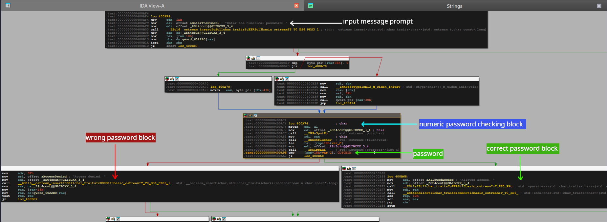

## Binary Information

```
Binary Name => VVSC
Language => C/C++
Arch => x86x64
Platform => Unix/Linux
```

```bash
$ file VVSC 
VVSC: ELF 64-bit LSB executable, x86-64, version 1 (SYSV), dynamically linked, interpreter /lib64/ld-linux-x86-64.so.2, for GNU/Linux 2.6.24, BuildID[sha1]=7ea0eace145e89811a030f9914f6637e69d29d66, not stripped
```


## Analysis


### Static Analysis

I opened my IDA to get a workflow diagram of what was happening. Below is the image of the workflow.




#### Program Workflow

- Takes numeric password as input
- Checks if the password is correct or not
- If password is correct then print **Allowed access** else **Access denied**

By checking the above image you probably have entered the password but still couldn't crack it , that's because the **password is in hex format**. Convert the password to decimal format and renter it. You can convert it using online tools. I used gdb myself.

```bash
gef➤  p/d 0xd80b1
$1 = 884913
gef➤  
```


## Testing our input

```bash
$ ./VVSC
Enter the numerical password: 
884913
Allowed access. 
```

Yea!!! we were able to solve this crackme challenge.