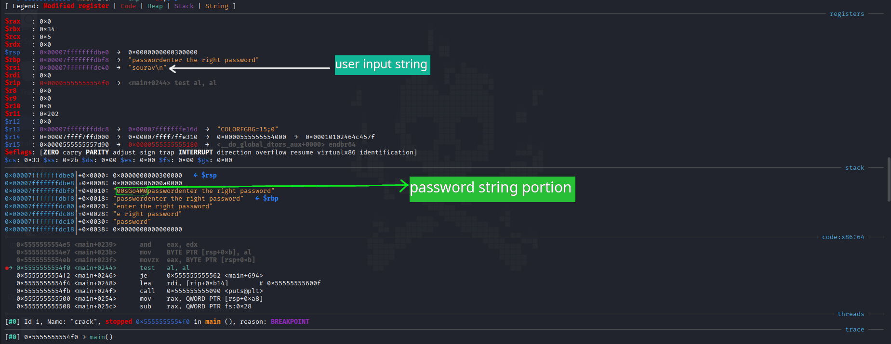

## Binary Information

```
Binary Name => good kitty
Language => C/C++
Arch => x86x64
Platform => Unix/Linux
```

```bash
$ file crack
crack: ELF 64-bit LSB pie executable, x86-64, version 1 (SYSV), dynamically linked, interpreter /lib64/ld-linux-x86-64.so.2, BuildID[sha1]=8c584d707909182cb49dab6ebe51cca2217ab1ed, for GNU/Linux 3.2.0, not stripped
```


## Analysis


### Static Analysis

Below is the disassembly of the **main()**. I have only pasted the essential part

```bash
.................................................. (SNIP) ..................................................
   0x00005555555554f0 <+580>:   test   al,al
   0x00005555555554f2 <+582>:   je     0x555555555562 <main+694>
   0x00005555555554f4 <+584>:   lea    rdi,[rip+0xb14]        # 0x55555555600f
   0x00005555555554fb <+591>:   call   0x555555555090 <puts@plt>
   0x0000555555555500 <+596>:   mov    rax,QWORD PTR [rsp+0xa8]
   0x0000555555555508 <+604>:   sub    rax,QWORD PTR fs:0x28
   0x0000555555555511 <+613>:   jne    0x555555555570 <main+708>
   0x0000555555555513 <+615>:   mov    eax,0x0
   0x0000555555555518 <+620>:   add    rsp,0xb8
   0x000055555555551f <+627>:   pop    rbx
   0x0000555555555520 <+628>:   pop    rbp
   0x0000555555555521 <+629>:   ret
   0x0000555555555522 <+630>:   mov    edx,DWORD PTR [rsp+0xc]
   0x0000555555555526 <+634>:   add    edx,0x1
   0x0000555555555529 <+637>:   mov    DWORD PTR [rsp+0xc],edx
   0x000055555555552d <+641>:   mov    edx,DWORD PTR [rsp+0xc]
   0x0000555555555531 <+645>:   movsxd rdx,edx
   0x0000555555555534 <+648>:   cmp    rdx,rax
   0x0000555555555537 <+651>:   jge    0x5555555554d9 <main+557>
   0x0000555555555539 <+653>:   mov    edx,DWORD PTR [rsp+0xc]
   0x000055555555553d <+657>:   cmp    edx,0x7
   0x0000555555555540 <+660>:   ja     0x5555555554d9 <main+557>
   0x0000555555555542 <+662>:   mov    ecx,DWORD PTR [rsp+0xc]
   0x0000555555555546 <+666>:   mov    edx,DWORD PTR [rsp+0xc]
   0x000055555555554a <+670>:   movsxd rcx,ecx
   0x000055555555554d <+673>:   movsxd rdx,edx
   0x0000555555555550 <+676>:   movzx  ebx,BYTE PTR [rsp+rdx*1+0x10]
   0x0000555555555555 <+681>:   cmp    BYTE PTR [rsp+rcx*1+0x60],bl
   0x0000555555555559 <+685>:   je     0x555555555522 <main+630>
   0x000055555555555b <+687>:   mov    BYTE PTR [rsp+0xb],0x0
   0x0000555555555560 <+692>:   jmp    0x555555555522 <main+630>
   0x0000555555555562 <+694>:   lea    rdi,[rip+0xa9b]        # 0x555555556004
   0x0000555555555569 <+701>:   call   0x555555555090 <puts@plt>
   0x000055555555556e <+706>:   jmp    0x555555555500 <main+596>
   0x0000555555555570 <+708>:   call   0x5555555550b0 <__stack_chk_fail@plt>
End of assembler dump.
gef➤  x/s 0x555555556004
0x555555556004: "bad kitty!"
gef➤  x/s 0x55555555600f
0x55555555600f: "good kitty!"
gef➤ 
```

#### Program Workflow

- Takes a password as user input.
- If password is correct **good kitty!** is printed otherwise **bad kitty!** is printed.


## Dynamic Analysis

- I setup the breakpoints at **main()** and at `0x00005555555554f0 <+580>:   test   al,al`.

```bash
gef➤  i b
Num     Type           Disp Enb Address            What
1       breakpoint     keep y   0x00005555555552ac <main>
        breakpoint already hit 1 time
2       breakpoint     keep y   0x00005555555554f0 <main+580>
```

- I ran the program after that, and I noticed somewhere between breakpoint 3 and breakpoint 4 there was a **unique string** which got placed inside the stack. Below is the image of the stack condition when that happens.




## Testing our input


```bash
$ ./crack
enter the right password
00sGo4M0
good kitty!
```

Yeah!!! we were able to solve this crackme challenge.